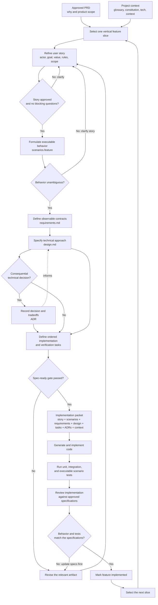

# Spec-Driven Development Workflow

This workflow progressively turns product intent into a bounded,
implementation-ready feature packet. Work on one independently valuable
vertical slice at a time rather than specifying the entire product upfront.



## Artifact Responsibilities

| Artifact | Defines | Completion gate |
| --- | --- | --- |
| `specs/prds/PRD-NNN.md` | Product vision, outcomes, epics, constraints, and boundaries | Product intent is approved |
| `user-story.md` | Actor, goal, value, business rules, examples, and scope | Story is valuable, small, testable, and approved |
| `scenarios.feature` | Executable behavioral examples, including failure and boundary cases | Behavior is unambiguous |
| `requirements.md` | Inputs, outputs, validation, errors, invariants, and quality requirements | Every requirement traces to behavior |
| `design.md` | Components, interfaces, state flow, technical choices, risks, and verification | The implementation approach is explicit |
| ADRs | Durable decisions and their alternatives and tradeoffs | Consequential decisions are recorded |
| `tasks.md` | Ordered implementation work and completion checks | Each task is actionable and verifiable |

## Spec-Ready Checklist

A feature is ready for code generation when:

- The story is approved.
- No blocking product, domain, dependency, or behavior questions remain.
- Gherkin covers happy paths, alternate paths, failures, and boundaries.
- Normative requirements contain no unresolved `TBD` values.
- External interfaces, data contracts, errors, and state transitions are explicit.
- The design and any relevant ADRs are approved.
- Tasks include dependencies and concrete verification checks.
- The artifacts agree with one another and form a complete trace from story to test.

## Skill Mapping

| Workflow step | Skill | Output |
| --- | --- | --- |
| Product intent | `create-prd` | `specs/prds/PRD-NNN.md` |
| Story refinement | `refine-user-stories` | `user-story.md` |
| Executable behavior | `user-story-to-gherkin` | `scenarios.feature` |
| Observable contract | `create-requirements` | `requirements.md` |
| Technical approach | `create-design` | `design.md` and related ADRs |
| Implementation plan | `create-tasks` | `tasks.md` |

## Implementation Packet

Give the code-generation agent the complete feature context:

```text
user-story.md
scenarios.feature
requirements.md
design.md
tasks.md
related ADRs
project glossary and context
specs/CONSTITUTION.md
```

The agent should not invent missing product behavior. If implementation reveals
a behavioral change, update and approve the affected specifications before
changing the code. Rust implementation must also satisfy the normative rules and
verification gates in `specs/CONSTITUTION.md`.

## Example Slice Order For `kv`

1. Collection lifecycle: create, list, and destroy named collections.
2. Ingestion and exact retrieval: add files, update a collection, and retrieve a complete file.
3. Lexical search: return ranked passages in the default human-readable format.
4. Machine output: expose JSON results, positions, and provenance.
5. Hybrid search: add semantic indexing and fused lexical-semantic ranking.
6. Contextual retrieval: expose related entities and concept links.

Technical questions should be resolved just in time. For example, the embedded
database decision is needed before designing the first persistence-dependent
slice, while model decisions can wait until semantic or entity indexing is
specified.
