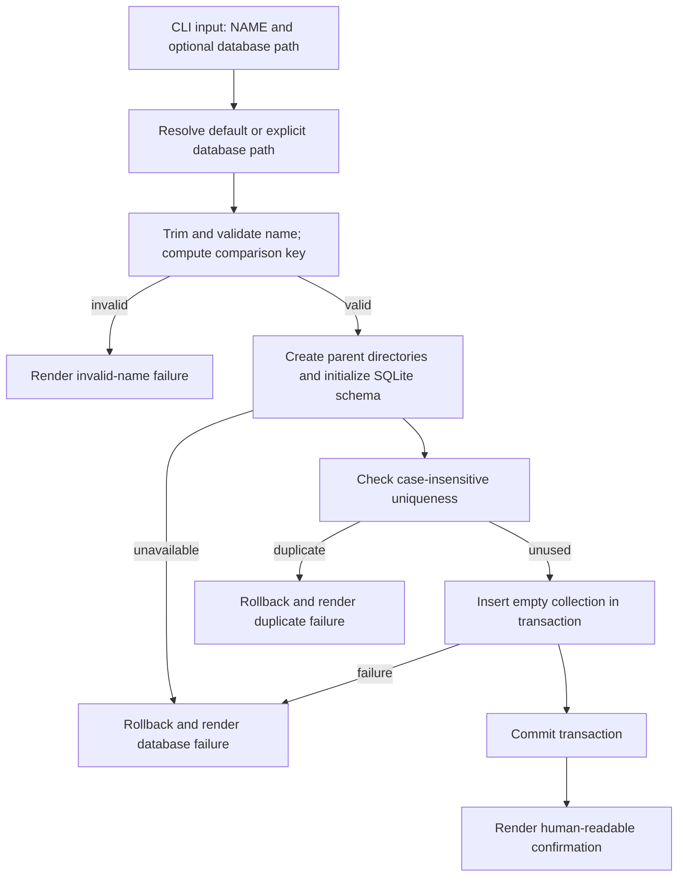

# Design

## Context And Constraints

This feature creates the persistent boundary that later ingestion and indexing
features will use. The implementation must preserve the approved behavior in
`REQ-001` while respecting the PRD constraints:

- The application is a local-first Rust single binary.
- All Rust implementation must comply with the normative rules and gates in `specs/CONSTITUTION.md`.
- The default database is `~/.mdsearch/collections.db`, with `--database PATH` as an override.
- All collections for a database are stored in one file.
- Collection creation must work without network access or external services.
- A failed create operation must not leave a partial collection.
- SQLite with the `sqlite-vector` extension must leave room for lexical, semantic, and contextual indexes in the same file.
- Embeddings will be created locally through the Rust `fastembed` library.
- `async-graphql` is an internal in-process context-query layer; no GraphQL server is exposed by this feature.

## Proposed Design

Use Rust and SQLite as the embedded database and system of record for collection
metadata. The `sqlite-vector` extension provides in-process vector storage and
search for future semantic indexing. SQLite provides one portable file,
transactional writes, and an in-process integration suitable for the single
binary. The selected approach is recorded in `ADR-001`.

The create flow is:

1. Parse `mdsearch collection create NAME` and the optional `--database PATH`.
2. Resolve the default or explicit database path.
3. Trim and validate the collection name before creating or modifying a database.
4. Create missing parent directories and initialize the SQLite schema when needed.
5. Compute a case-insensitive comparison key for the trimmed name.
6. Insert the collection in one transaction protected by a unique constraint on the comparison key.
7. Commit the transaction before rendering the success confirmation.
8. Map validation, duplicate, and database failures to semantic human-readable errors.

The default path resolves `~` against the invoking user's home directory. An
explicit path is used as supplied after normal filesystem resolution. Missing
parent directories are created as part of database initialization; inability to
resolve or access the path is a database failure.

Name normalization trims surrounding whitespace, rejects `/`, `\`, and Unicode
control characters, and computes a Unicode-aware case-folded comparison key.
The trimmed input remains the display name. There is no product-defined maximum
name length.

The initial collection schema is:

| Field | Constraint | Purpose |
| --- | --- | --- |
| `collection_id` | Internal primary key | Stable database identity for later relationships |
| `display_name` | Required, trimmed | Original spelling retained for human output |
| `name_key` | Required, unique | Unicode-aware case-insensitive uniqueness key |
| `created_at` | Required | Creation metadata for operations and future display |

Schema creation and migration are versioned. The collection schema does not add
file, lexical, semantic, or entity records; those belong to later slices and
must use the same database file.

SQLite FTS5 is reserved for the future lexical index. The Rust `fastembed`
library will create local embeddings, which will be stored and searched through
the `sqlite-vector` extension. Entity nodes and edges will be represented by
relational tables in SQLite, and `async-graphql` will provide an internal
in-process schema and query layer over contextual data. None of these future
capabilities exposes a network server. Semantic and entity approaches require
their own feature designs and performance validation.

## Components And Responsibilities

| Component | Responsibility | Depends on |
| --- | --- | --- |
| CLI command handler | Accept the create command, pass inputs to the application flow, and select the human-readable result | CLI argument parser |
| Database path resolver | Select `~/.mdsearch/collections.db` or the value supplied by `--database PATH` | User home directory and filesystem |
| Collection name validator | Trim the input, reject invalid characters and empty values, and produce the canonical comparison key | Unicode and path-character rules |
| Database initializer | Create parent directories when needed, open the SQLite file, and apply the collection schema | SQLite integration |
| Collection repository | Check uniqueness and insert the collection within a transaction | Database initializer |
| Output and error renderer | Render confirmation or semantic failure information without exposing implementation details | Command result types |
| Embedding service | Create local embeddings for future ingestion and semantic indexing | Rust `fastembed` library |
| Vector index | Store and search embeddings in the same database file | `sqlite-vector` extension |
| Context query layer | Define and execute internal contextual graph queries | Rust `async-graphql` library and SQLite graph tables |

## Interfaces And Contracts

| Interface | Inputs | Outputs | Errors |
| --- | --- | --- | --- |
| Create collection command | `NAME`; optional `--database PATH` | Success confirmation containing the retained name | Invalid name, duplicate name, database unavailable, storage failure |
| Database path resolution | Optional path override | Resolved database path | Home directory unavailable, invalid path, path access failure |
| Collection name normalization | Raw collection name | Trimmed display name and canonical comparison key | Empty value, whitespace-only value, path separator, control character |
| Collection repository create | Display name, comparison key, database transaction | Persisted empty collection | Duplicate comparison key, schema failure, transaction failure |

The command result must distinguish these externally relevant outcomes:

- Success: one empty collection was committed and its retained display name is reported.
- Invalid input: no collection is created and the output identifies invalid naming input.
- Duplicate: no collection is created or changed and the output identifies name collision.
- Database failure: the operation fails without partial collection state and the output identifies database access or storage failure.

Exact human-readable wording remains flexible as specified by `REQ-001`.

## Data And State Flow

The schema initialization and collection insert are transactional from the
application's perspective. A database file may remain after a failed schema
initialization, but no partially created collection may remain.

## Security, Performance, And Operations

- Security: use the invoking user's filesystem permissions; do not require network access or broaden database-file permissions. Keep embedding models local and do not expose the context query layer as a network service.
- Performance: collection creation is a single local transaction and performs no file ingestion or indexing.
- Operations: create the default database parent directory when absent; report path access failures semantically; honor the explicit path override. Package or validate `sqlite-vector` availability with the single binary.
- Recovery: validation happens before database mutation, duplicate detection is protected by a unique comparison key, and failed writes are rolled back.
- Compatibility: future schema changes must be versioned and migrated without moving collections to another database file.

## Alternatives Considered

| Alternative | Why not chosen |
| --- | --- |
| SQLite with FTS5, `sqlite-vector`, relational graph tables, `fastembed`, and internal `async-graphql` | Chosen because it satisfies the single-file, embedded, transactional, Rust, offline, vector, and contextual-query constraints |
| SQLite with application-managed vector scoring | Not chosen because the selected `sqlite-vector` extension provides a direct in-process vector-search path |
| Separate databases for relational, vector, and graph data | Rejected because it violates the one-database-file product constraint |
| A vector-first embedded database | Rejected for this slice because collection lifecycle, metadata, lexical search, and graph relationships require broader relational behavior |
| DuckDB as the system of record | Not chosen because this workflow is write/update oriented and requires a durable lexical and relationship model in one application database |

## Risks And Open Decisions

- `ADR-001` records the approved storage and local query stack; extension packaging remains subject to validation.
- The exact Rust SQLite integration and migration library are implementation choices for the task breakdown.
- The exact `sqlite-vector` build and loading strategy must be validated for the single binary.
- `fastembed` model selection and local model-asset lifecycle need a separate embedding design.
- `async-graphql` must remain an internal query layer unless a future approved PRD changes the no-server boundary.
- Unicode case-insensitive comparison must be covered by tests so the stored comparison key matches the product rule.
- Semantic vector storage and search require a separate benchmark before EPIC-004 is designed.
- The database path behavior on platforms without a conventional home directory needs an implementation-level error policy.

## Verification Approach

- Unit-test name trimming, invalid-character detection, canonical comparison-key generation, and duplicate comparisons.
- Integration-test creation with the default path and an explicit path using isolated temporary databases.
- Verify automatic database initialization and persistence across separate CLI invocations.
- Verify duplicate rejection preserves the original display name and creates no second record.
- Verify invalid input is rejected before collection creation.
- Verify database-open, schema, and write failures leave no partial collection.
- Verify the packaged SQLite build loads `sqlite-vector` in the single binary before implementing semantic indexing.
- Verify `fastembed` can create embeddings from local model assets without network access.
- Verify the `async-graphql` context schema executes in-process without introducing server mode.
- Run every scenario in `scenarios.feature` as an executable acceptance test once the CLI exists.
- Run the Rust constitution gates from `specs/CONSTITUTION.md` before marking the implementation complete.
