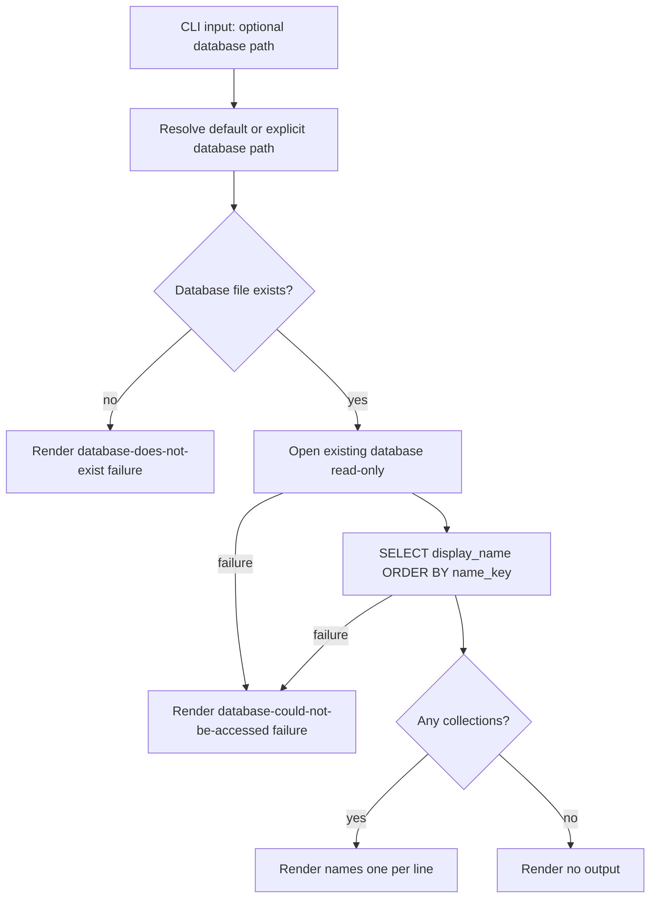

# Design

## Context And Constraints

This feature reads the collections already persisted by `US-001` and renders
their retained display names. The implementation must preserve the approved
behavior in `REQ-002` while respecting the PRD constraints:

- The application is a local-first Rust single binary.
- All Rust implementation must comply with `specs/CONSTITUTION.md`.
- The default database is `~/.mdsearch/collections.db`, with `--database PATH`
  as an override.
- The command is read-only and must never create, modify, or initialize a
  database.
- A missing database is a distinct, reportable failure from an inaccessible
  one.
- Output is one display name per line in case-insensitive alphabetical order,
  with no header or decoration.
- The `collections` table already stores a Unicode case-folded `name_key`
  unique key; no schema change is required.

## Proposed Design

Extend the existing `CollectionStore` port and `SQLite` adapter with a read-only
list path, and add a `ListCollections` use case plus a `collection list` CLI
subcommand.

- The store gains a read-only constructor `open_existing` that never creates
  parent directories or runs schema DDL, and a `list_collections` method that
  selects and orders stored names.
- Sorting uses the stored `name_key` column, which is the Unicode case-folded
  form of the display name and is unique per collection. Ordering by `name_key`
  yields case-insensitive alphabetical order of the display names without a new
  column or collation.
- The list use case delegates to the port and returns the names; the CLI layer
  formats them one per line.
- An empty result is rendered as no output at all (the binary skips printing an
  empty result), not a blank line.

## Components And Responsibilities

| Component | Responsibility | Depends on |
| --- | --- | --- |
| `ListCollections` use case | Read all collections through the port and return their names | `CollectionStore` port |
| `CollectionStore` port | Declare the read-only list operation in domain terms | `domain` types |
| `SqliteCollectionStore` adapter | Open an existing database read-only and query stored names | `rusqlite` |
| CLI command handler | Accept `collection list`, pass the optional path, render one name per line | CLI parser and use case |
| Output renderer | Join names with newlines; emit nothing when empty | command result |

## Interfaces And Contracts

| Interface | Inputs | Outputs | Errors |
| --- | --- | --- | --- |
| `CollectionStore::list_collections` | Open store connection | `Vec<CollectionName>` in case-insensitive alphabetical order | `DatabaseUnavailable`, `Storage` |
| `SqliteCollectionStore::open_existing` | Database path | Read-only store | `DatabaseNotFound`, `DatabaseUnavailable` |
| `ListCollections::execute` | Store | `Vec<CollectionName>` | `CollectionStoreError` |
| CLI `mdsearch collection list` | Optional `--database PATH` | Newline-joined names, or no output when empty | "database does not exist", "database could not be accessed" |

The list command must distinguish these externally relevant outcomes:

- Success: names are listed one per line in case-insensitive alphabetical
  order, or nothing is printed when the database is empty.
- Missing database: the command fails, reports that the database does not
  exist, and creates no file.
- Inaccessible database: the command fails and reports that the database could
  not be accessed.

Exact human-readable wording remains flexible as specified by `REQ-002`.

## Data And State Flow

The operation performs no writes and no DDL. A missing file is detected before
opening so that no database file is ever created by listing.

## Security, Performance, And Operations

- Security: read under the invoking user's filesystem permissions; no network
  access; no elevation or broadening of file permissions.
- Performance: a single indexed read ordered by the unique `name_key` column;
  no full-table in-memory sort.
- Operations: do not create parent directories or schema; report missing and
  inaccessible databases as distinct semantic failures; honor the explicit path
  override.
- Compatibility: no schema or migration change; existing databases remain
  unchanged.

## Alternatives Considered

| Alternative | Why not chosen |
| --- | --- |
| Sort by `display_name COLLATE NOCASE` | `NOCASE` folds ASCII only; ordering by the stored Unicode `name_key` is already case-insensitive and requires no collation |
| Sort in application code after `SELECT` | Adds an in-memory sort for no benefit when the database can order by the stored key |
| Reuse `SqliteCollectionStore::open` for listing | `open` creates parent directories and runs schema DDL, violating the read-only contract |
| Return raw display-name strings from the port | Loses domain typing (`CollectionName`) and weakens the port contract |
| Treat a missing database as empty | Contradicts the approved story, which requires a distinct failure |

## Risks And Open Decisions

- Ordering beyond the stored `name_key` byte order (locale-aware collation) is
  out of scope; the approved examples are ASCII.
- An existing but corrupt or empty database file (where the `collections` table
  is absent) maps the read failure to a storage error rather than a distinct
  message; acceptable because exact wording is not contractual.
- A formal shared contract-test suite across both `CollectionStore`
  implementations is noted as a follow-up; this slice tests both implementations
  against the same behavioral expectations without introducing a new harness.

## Verification Approach

- Unit-test the error mapping for missing and inaccessible databases.
- Application-test `ListCollections` with an in-memory fake returning names in
  insertion order to prove the use case passes them through.
- Integration-test the `SQLite` store: `open_existing` returns `DatabaseNotFound`
  for a missing file and never creates it; an empty database lists no names;
  multiple names come back case-insensitively sorted.
- CLI-test the command: happy path, empty database produces no output, missing
  database fails without creating a file, inaccessible database fails, custom
  path is honored, and a collection created in an earlier run remains listed.
- Run every scenario in `scenarios.feature` as an executable acceptance test.
- Run the Rust constitution gates from `specs/CONSTITUTION.md` before marking the
  implementation complete.
