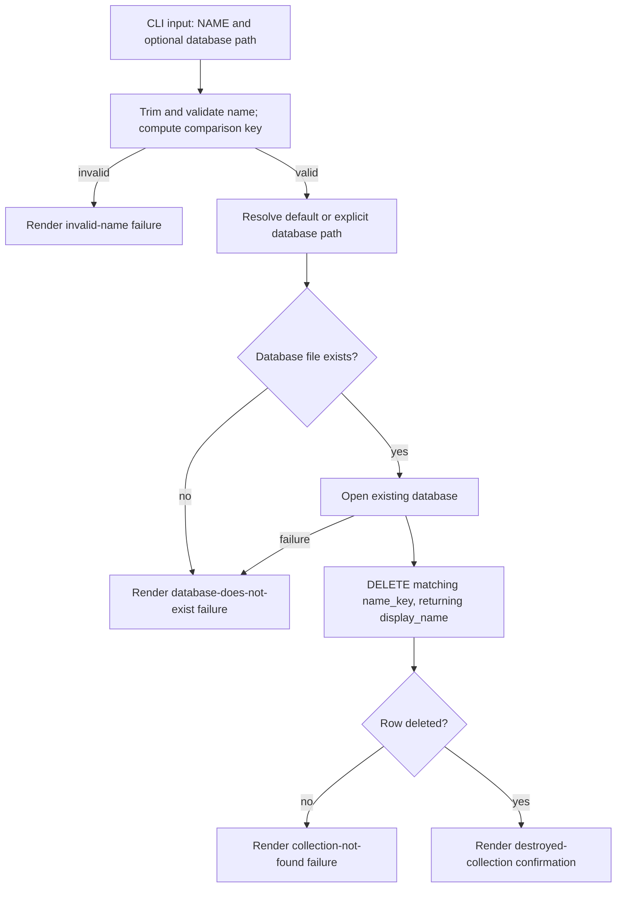

# Design

## Context And Constraints

This feature removes a named collection permanently, completing the collection
lifecycle begun by `US-001` and made observable by `US-002`. The implementation
must preserve the approved behavior in `REQ-003` while respecting the PRD
constraints:

- The application is a local-first Rust single binary.
- All Rust implementation must comply with `specs/CONSTITUTION.md`.
- The default database is `~/.mdsearch/collections.db`, with `--database PATH`
  as an override.
- A missing database is a distinct failure from a missing collection.
- Invalid names are rejected before touching the database, consistent with
  `collection create`.
- Destruction is permanent and requires no confirmation.
- The confirmation reports the retained first-created spelling, even when the
  user types a case variant.

## Proposed Design

Extend the existing `CollectionStore` port and `SQLite` adapter with a destroy
operation, and add a `DestroyCollection` use case plus a `collection destroy`
CLI subcommand.

- The store reuses `open_existing`, which opens an existing database without
  running DDL and reports `DatabaseNotFound` when the file is absent. The
  connection is writable, so no separate open mode is required.
- `destroy_collection` matches by the stored case-folded `name_key` and deletes
  the matching row with `DELETE ... RETURNING display_name` so the retained
  spelling is returned for the confirmation. Zero affected rows map to
  `CollectionNotFound`.
- The use case validates the input name through `CollectionName`, so invalid
  names are rejected before any database access.
- The CLI layer formats the human-readable confirmation from the returned
  retained spelling.

## Components And Responsibilities

| Component | Responsibility | Depends on |
| --- | --- | --- |
| `DestroyCollection` use case | Validate nothing, call the port, return the destroyed name | `CollectionStore` port, `CollectionName` |
| `CollectionStore` port | Declare the destroy operation in domain terms | `domain` types |
| `SqliteCollectionStore` adapter | Open an existing database and delete the matching row | `rusqlite` |
| CLI command handler | Accept `collection destroy`, validate the name, render confirmation | CLI parser and use case |
| Output renderer | Format the destroyed collection confirmation | command result |

## Interfaces And Contracts

| Interface | Inputs | Outputs | Errors |
| --- | --- | --- | --- |
| `CollectionStore::destroy_collection` | `&CollectionName` | Destroyed `CollectionName` (retained spelling) | `CollectionNotFound`, `DatabaseNotFound`, `Storage` |
| `SqliteCollectionStore::open_existing` | Database path | Writable store | `DatabaseNotFound`, `DatabaseUnavailable` |
| `DestroyCollection::execute` | `&CollectionName` | Destroyed `CollectionName` | `CollectionStoreError` |
| CLI `mdsearch collection destroy` | `NAME`; optional `--database PATH` | `destroyed collection "NAME"` | "collection not found", "database does not exist", "invalid name" |

The destroy command must distinguish these externally relevant outcomes:

- Success: the matching collection is removed and the retained spelling is
  reported.
- Missing collection: the command fails, reports that the collection was not
  found, and leaves the database unchanged.
- Missing database: the command fails, reports that the database does not
  exist, and creates no file.
- Invalid name: the command is rejected before any database access.

Exact human-readable wording remains flexible as specified by `REQ-003`.

## Data And State Flow

The operation mutates only the targeted row. A missing file is detected before
opening so that destroy never creates a database file.

## Security, Performance, And Operations

- Security: write under the invoking user's filesystem permissions; no network
  access; no elevation or broadening of file permissions.
- Performance: a single row delete keyed by the unique `name_key` column.
- Operations: do not create parent directories or schema; report missing
  database and missing collection as distinct failures; honor the explicit path
  override.
- Recovery: a failed delete (missing collection) leaves the database unchanged;
  the operation is destructive by design and offers no undo.
- Compatibility: no schema or migration change. Future `files` or index rows
  will reference `collections.collection_id` with `ON DELETE CASCADE` so that a
  collection destroy removes its descendants in later slices.

## Alternatives Considered

| Alternative | Why not chosen |
| --- | --- |
| Soft delete (tombstone column) | The PRD says "destroys" and the story requires permanent removal; a tombstone adds state and complicates later slices |
| Reuse `SqliteCollectionStore::open` for destroy | `open` creates parent directories and runs schema DDL, which is wrong for a destructive command targeting an existing database |
| Match by raw display name with `COLLATE NOCASE` | The stored `name_key` already provides Unicode case-insensitive matching and uniqueness |
| Return the user's input casing in the confirmation | The story requires confirming the retained first-created spelling |

## Risks And Open Decisions

- `DELETE ... RETURNING` requires SQLite 3.35 or newer; the bundled `rusqlite`
  SQLite satisfies this.
- A destroyed collection is unrecoverable; no undo is in scope.
- Collection cascading to future child tables is deferred until ingestion adds
  them.

## Verification Approach

- Unit-test error mapping for missing collection and missing database.
- Application-test `DestroyCollection` with an in-memory fake that removes by
  case-insensitive key and returns the retained spelling.
- Integration-test the `SQLite` store: case-insensitive delete, `CollectionNotFound`
  for an absent name, `DatabaseNotFound` for a missing file without creating it,
  and other collections remaining intact.
- CLI-test the command: happy path, case-insensitive match, non-existent
  collection, missing database, invalid names, and removal reflected in a later
  `collection list`.
- Run every scenario in `scenarios.feature` as an executable acceptance test.
- Run the Rust constitution gates from `specs/CONSTITUTION.md` before marking the
  implementation complete.
