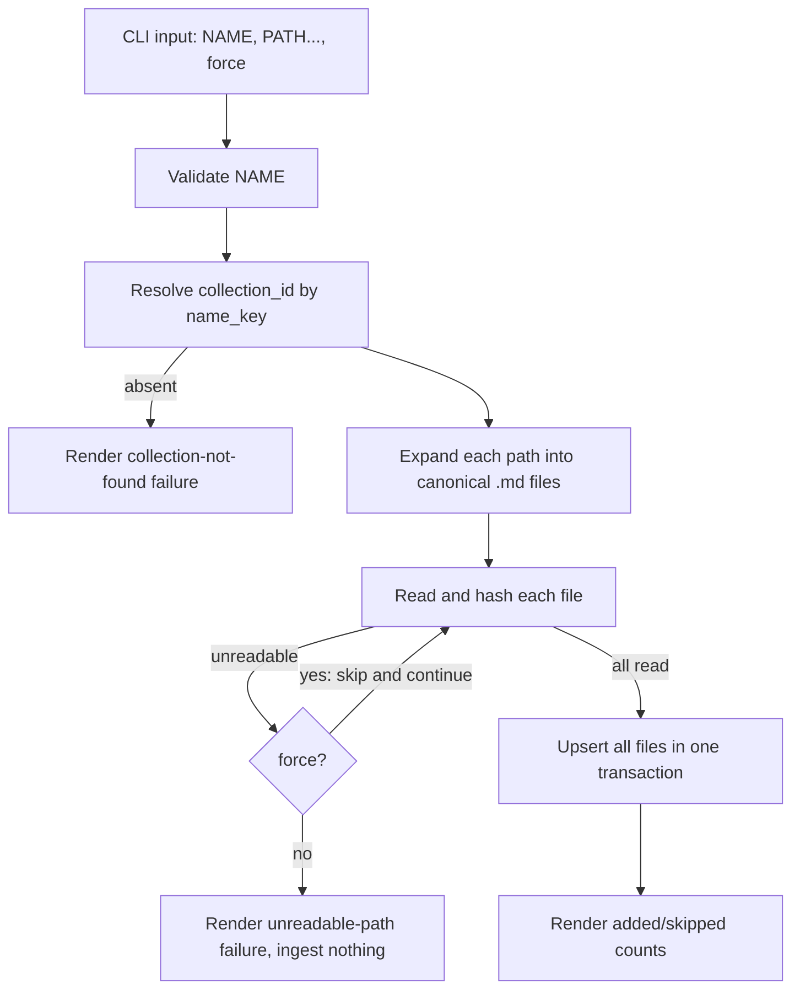

# Design

## Context And Constraints

This feature ingests markdown files into an existing collection, storing each
file's content and metadata with a stable database identity for later indexing.
The implementation must preserve the approved behavior in `REQ-004` while
respecting the PRD constraints:

- The application is a local-first Rust single binary.
- All Rust implementation must comply with `specs/CONSTITUTION.md`.
- The default database is `~/.mdsearch/collections.db`, with `--database PATH`
  as an override.
- Only `.md` files are ingested; directories are walked recursively.
- Files are identified by canonical absolute path; re-adds upsert.
- Without `--force`, an unreadable path fails the whole command and ingests
  nothing; with `--force`, unreadable paths are skipped and reported.
- Content hashing uses the newly approved `sha2` crate (pure Rust, no unsafe,
  MIT/Apache-2.0), added to `domain` as a permitted pure-computation dependency
  (R-DIR-02).

## Proposed Design

Ingest files through three ports orchestrated by an `AddFiles` use case, and
persist them in a new `files` table introduced by a versioned migration.

- The `FileSystem` port discovers canonical `.md` paths and reads file bytes.
- The `AddFiles` use case resolves the collection, expands inputs into files,
  reads and hashes each file, then upserts all files in one transaction through
  the `FileStore` port.
- Reading and hashing complete before any write, so a failure without `--force`
  ingests nothing. `--force` skips unreadable paths and continues.
- The `files` table is added by bumping the schema version to 2 via a small
  migration function; `open_existing` remains DDL-free for the read-only and
  destroy commands.

## Components And Responsibilities

| Component | Responsibility | Depends on |
| --- | --- | --- |
| `ContentHash` (domain) | Compute and hold a SHA-256 content hash | `sha2` |
| `FileSystem` port | Discover canonical `.md` files and read bytes | `domain` types |
| `FileStore` port | Upsert file records for a collection in one transaction | `domain` types |
| `AddFiles` use case | Orchestrate expand, read, hash, and upsert with skip semantics | `FileSystem`, `FileStore`, `Clock`, `CollectionStore` resolution |
| `SystemFileSystem` (infrastructure) | Walk and read the real filesystem | `std::fs` |
| `SqliteFileStore` (store-sqlite) | Persist files and run the schema migration | `rusqlite` |
| CLI command handler | Accept `collection add`, pass inputs and flags, render the count | CLI parser and use case |

## Interfaces And Contracts

| Interface | Inputs | Outputs | Errors |
| --- | --- | --- | --- |
| `FileSystem::expand` | One input path | Canonical `.md` file paths (empty for non-`.md` files) | `FileSystemError` for missing or unreadable paths |
| `FileSystem::read` | Canonical path | File bytes | `FileSystemError` for unreadable files |
| `FileStore::upsert_files` | `&CollectionName`, `&[FileRecord]`, `Timestamp` | Nothing | `CollectionNotFound`, storage error |
| `AddFiles::execute` | `&CollectionName`, `&[PathBuf]`, `force` | `{ added, skipped }` | `AddFilesError` |
| CLI `mdsearch collection add` | `NAME`, `PATH...`, `--database PATH?`, `--force` | `added N file(s) to collection "NAME"` (+ ` (skipped N)`) | "collection not found", "database does not exist", "unreadable path" |

The add command must distinguish these externally relevant outcomes:

- Success: files are ingested and the count is reported.
- Missing collection: the command fails and reports the collection was not found.
- Missing database: the command fails, reports the database does not exist, and
  creates no file.
- Unreadable path without `--force`: the command fails and ingests nothing.
- Unreadable path with `--force`: the path is skipped and the skip is reported.

## Data And State Flow

Writes happen only after every file has been read and hashed, so failure before
the upsert leaves the database unchanged.

## Security, Performance, And Operations

- Security: read the filesystem under the invoking user's permissions; no
  network access; no broadening of file permissions.
- Performance: one directory walk and one batched transaction per add; hashing
  is in-memory and proportional to content size. Reads are held in memory until
  the single transactional write, acceptable at the PRD document scale.
- Operations: migrate the database to schema version 2 idempotently; do not
  create the database file when it is missing; report skipped paths under
  `--force`.
- Recovery: a failed add without `--force` writes nothing; retrying is safe.
  Upserting is idempotent by canonical path.
- Compatibility: `open_existing` continues to perform no DDL, preserving the
  read-only guarantee for `collection list`.

## Alternatives Considered

| Alternative | Why not chosen |
| --- | --- |
| Extend the `CollectionStore` port with file methods | Violates R-TRT-08 by turning a focused port into a fat repository |
| Add a new `adapters/fs` crate | Would introduce a new workspace member; `infrastructure` already hosts OS adapters such as `SystemClock` |
| Store paths as-supplied | Breaks change detection when the working directory changes; canonical absolute paths are stable |
| Compare raw bytes instead of hashing | A stored SHA-256 hash is the approved change-detection mechanism and is reused by the update slice |
| Interleave read and write with a DB transaction rollback | Read-all-then-write is simpler and still atomic |
| Treat a missing database as creatable | Contradicts the approved story: the collection must already exist |

## Risks And Open Decisions

- The `.md` extension check is case-insensitive (`eq_ignore_ascii_case`).
- The migration is a minimal, append-only version bump; a richer migration
  framework is deferred until a later slice needs it.
- Frontmatter parsing and content extraction are explicitly out of scope here.
- File retrieval by ID is deferred to `EPIC-006`, so `FileId` is not yet modeled.

## Verification Approach

- Domain: property-test that identical content yields identical hashes and
  differing content yields differing hashes.
- Application: `AddFiles` use case with fakes for success, recursion,
  non-`.md` ignoring, upsert, atomic failure, and `--force` skip.
- Store: integration-test the migration to version 2, upsert-by-path idempotency,
  retained `file_id` and `created_at`, and collection-not-found.
- Infrastructure: `SystemFileSystem` walk, read, canonicalization, and extension
  filtering against a temporary directory tree.
- CLI: command parsing, counts, `--force` skips, missing collection/database,
  and the `--database` override.
- Run every scenario in `scenarios.feature` as an executable acceptance test.
- Run the Rust constitution gates from `specs/CONSTITUTION.md` before marking the
  implementation complete.
