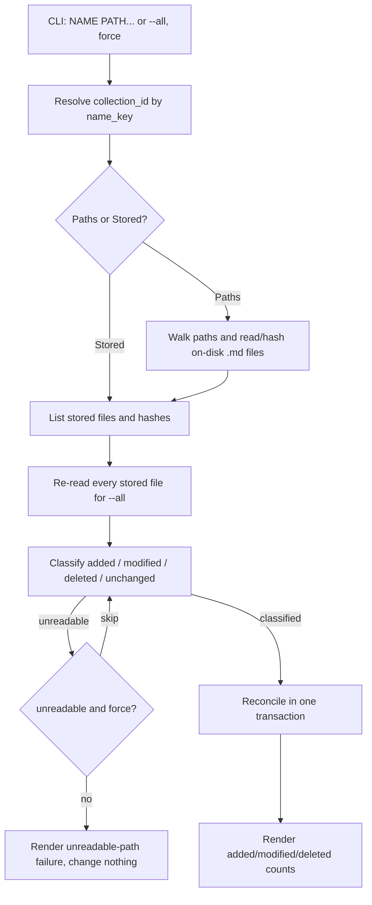

# Design

## Context And Constraints

This feature reconciles a collection's stored files with the current on-disk
state, ingesting new files, re-ingesting modified files, and removing deleted
files. The implementation must preserve the approved behavior in `REQ-005`
while respecting the PRD constraints:

- The application is a local-first Rust single binary.
- All Rust implementation must comply with `specs/CONSTITUTION.md`.
- The default database is `~/.mdsearch/collections.db`, with `--database PATH`
  as an override.
- Files are identified by canonical absolute path; content changes are detected
  by SHA-256 hash; deletions are detected by path existence.
- Only `.md` files are considered; directories are walked recursively.
- Without `--force`, an unreadable path fails the command atomically; with
  `--force`, unreadable paths are skipped and reported.
- No schema change, no new dependency, and no new workspace member are required.

## Proposed Design

Add a read phase and an atomic write phase to the file store, and orchestrate
them in an `UpdateCollection` use case.

- The `FileStore` port gains `list_files` (read stored paths and hashes) and
  `reconcile` (upsert added/modified files and delete removed files in one
  transaction).
- The `FileSystem` port gains `exists`, distinguishing a missing path from an
  unreadable one.
- The `UpdateCollection` use case walks the supplied paths (or re-reads every
  stored file for `--all`), classifies each file as added, modified, deleted,
  or unchanged, then applies the changes atomically.
- `ContentHash::try_from_hex` reconstructs stored hashes for type-safe
  comparison.

## Components And Responsibilities

| Component | Responsibility | Depends on |
| --- | --- | --- |
| `ContentHash` (domain) | Compute and reconstruct SHA-256 hashes | `sha2` |
| `FileStore` port | List stored files and reconcile changes atomically | `domain` types |
| `FileSystem` port | Walk, read, and test existence of files | `domain` types |
| `UpdateCollection` use case | Classify and apply added/modified/deleted | `FileStore`, `FileSystem`, `Clock` |
| `SystemFileSystem` (infrastructure) | Filesystem operations with precise error kinds | `std::fs` |
| `SqliteFileStore` (store-sqlite) | Persist list/reconcile operations | `rusqlite` |
| CLI command handler | Accept `collection update`, dispatch per-mode | CLI parser and use case |

## Interfaces And Contracts

| Interface | Inputs | Outputs | Errors |
| --- | --- | --- | --- |
| `FileStore::list_files` | `&CollectionName` | `Vec<StoredFile>` | `CollectionNotFound`, storage error |
| `FileStore::reconcile` | `&CollectionName`, `&[FileRecord]`, `&[PathBuf]`, `Timestamp` | Nothing | `CollectionNotFound`, storage error |
| `FileSystem::exists` | `&Path` | `bool` (false only for `NotFound`) | `FileSystemError` |
| `UpdateCollection::execute` | `&CollectionName`, `UpdateTarget`, `force` | `UpdateOutcome` | `UpdateCollectionError` |
| CLI `mdsearch collection update` | `NAME PATH...` or `--all`, `--database PATH?`, `--force` | `updated collection "NAME": added A, modified M, deleted D` (+ ` (skipped S)`) | "collection not found", "database does not exist", "unreadable path" |

`UpdateTarget` is `Paths(&[PathBuf])` for the single-collection command or
`Stored` for `--all`. `UpdateOutcome` carries `added`, `modified`, `deleted`,
and `skipped` counts.

## Data And State Flow

All reads and classification happen before any write, so a failure without
`--force` leaves the database unchanged.

## Security, Performance, And Operations

- Security: read the filesystem under the invoking user's permissions; no
  network access; no broadening of file permissions.
- Performance: one walk (or one pass over stored files), one read per changed
  file, and one transactional write. Deleted detection uses `exists`, not a full
  read.
- Operations: no schema or migration change; reuse `open_for_ingestion`.
- Recovery: a failed update without `--force` writes nothing; retrying is safe.
  Reconcile is idempotent by canonical path.
- Compatibility: `open_existing` remains DDL-free; `open_for_ingestion` and the
  schema are unchanged from `DES-004`.

## Alternatives Considered

| Alternative | Why not chosen |
| --- | --- |
| Store source roots for `--all` discovery | Requires a new roots table and changes `add`; the approved story uses explicit paths |
| Reuse `Path::exists()` for deletion | Cannot distinguish a missing file from an unreadable one, risking silent deletion |
| Separate upsert and delete transactions | Would leave partial state if the second write fails |
| Compare hashes as raw strings | Loses type safety; `try_from_hex` reconstructs the domain type |

## Risks And Open Decisions

- Files outside the walked paths of `update NAME PATH...` are existence-checked
  but not re-hashed; only `--all` re-hashes every stored file.
- A stored file on a temporarily unavailable volume may be seen as deleted if
  `exists` reports `NotFound`; this is the approved path-existence semantics.

## Verification Approach

- Domain: `try_from_hex` accepts valid hashes and rejects malformed ones;
  round-trips with `from_content`.
- Application: `UpdateCollection` with fakes for added, modified, deleted,
  unchanged, atomic failure, `--force` skip, and `--all` (`Stored`).
- Store: `list_files` returns stored paths and hashes; `reconcile` upserts and
  deletes atomically; collection-not-found.
- Infrastructure: `exists` returns true/false/error for present/missing/unreadable
  paths.
- CLI: single and `--all` counts, `--force`, missing collection/database, and the
  `--database` override.
- Run every scenario in `scenarios.feature` as an executable acceptance test.
- Run the Rust constitution gates from `specs/CONSTITUTION.md` before marking the
  implementation complete.
