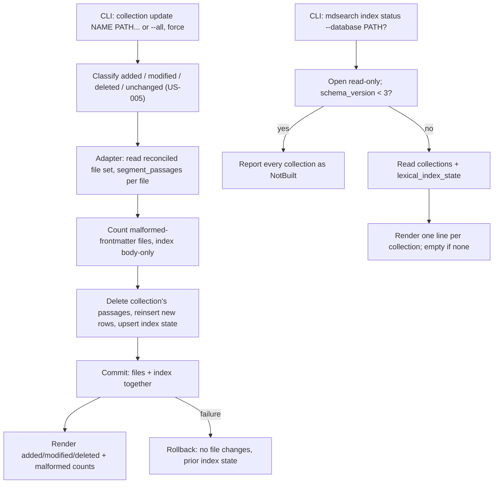

# Design

## Context And Constraints

This feature makes `collection update` build and keep current a per-passage
lexical (FTS5/BM25) index and adds `mdsearch index status` so the index state is
observable. The implementation must preserve the approved behavior in `REQ-006`
while respecting the PRD constraints:

- The application is a local-first Rust single binary.
- All Rust implementation must comply with `specs/CONSTITUTION.md`.
- Indexing is driven by the explicit update command; `collection add` never
  builds the index (FR-002).
- The index build is atomic with file reconciliation: failure fails the whole
  update and commits nothing (FR-013).
- The index covers body paragraphs and the `title`, `tags`, `aliases`, and
  `summary` frontmatter fields, each as its own passage (FR-003, FR-004).
- Frontmatter is optional and lenient: absent or malformed frontmatter is
  indexed body-only and reported without failing (FR-005, FR-006, FR-007).
- `mdsearch index status` reports per-collection state, file count, passage
  count, and last-build timestamp; a missing database fails without creating a
  file; a database with no collections reports nothing (FR-009..FR-015).
- FTS5 is available in the bundled SQLite build (libsqlite3-sys compiles with
  `SQLITE_ENABLE_FTS5`), so no new engine dependency is required.
- The `yaml-rust2` dependency for lenient frontmatter parsing and the
  full-rebuild-on-update strategy are approved in `ADR-005`.

## Proposed Design

Segment stored file content into passages in the domain layer, rebuild the
collection's index inside the same transaction as file reconciliation, and read
index status through a dedicated read-only port.

- The domain `passage` module exposes `segment_passages`, which leniently
  extracts the four recognized frontmatter fields and splits the body into
  paragraph passages; a malformed frontmatter block yields a body-only result
  flagged by `FrontmatterIssue`.
- `FileStore::reconcile` is extended: after applying the file changes, the
  adapter deletes the collection's existing passages and reinserts them from the
  reconciled file set in the same transaction. The port now returns
  `ReconcileOutcome` carrying the malformed-frontmatter count.
- The application `UpdateCollection` orchestration is unchanged; its
  `UpdateOutcome` gains a `malformed_frontmatter` count surfaced in the update
  output.
- A new `LexicalIndexStore` port and `IndexStatus` use case read the persisted
  index state for every collection through a DDL-free read-only store.

## Components And Responsibilities

| Component | Responsibility | Depends on |
| --- | --- | --- |
| `segment_passages` (domain) | Extract frontmatter fields leniently and split the body into paragraph passages | `yaml-rust2` |
| `Passage` / `PassageKind` (domain) | Hold a passage's text and kind (Body, Title, Tags, Aliases, Summary) | `domain` types |
| `FileStore` port | Reconcile files and rebuild the lexical index atomically | `domain` types |
| `LexicalIndexStore` port | Read per-collection index status | `domain` types |
| `UpdateCollection` use case | Orchestrate reconciliation and index rebuild | `FileStore`, `FileSystem`, `Clock` |
| `IndexStatus` use case | Read and return per-collection index status | `LexicalIndexStore` |
| `SqliteFileStore` (store-sqlite) | Apply file changes, rebuild FTS5 passages, persist index state | `rusqlite`, domain `passage` |
| `SqliteLexicalIndexStore` (store-sqlite) | Read index status without DDL | `rusqlite` |
| CLI command handlers | Accept `collection update` and `index status`, render output | CLI parser and use cases |

## Interfaces And Contracts

| Interface | Inputs | Outputs | Errors |
| --- | --- | --- | --- |
| `segment_passages` | `&[u8]` file content | `(Vec<Passage>, Option<FrontmatterIssue>)` | None (lenient; malformed frontmatter is flagged, not an error) |
| `FileStore::reconcile` | `&CollectionName`, `&[FileRecord]`, `&[PathBuf]`, `Timestamp` | `ReconcileOutcome { malformed_frontmatter }` | `CollectionNotFound`, `FileStoreError::Storage` |
| `LexicalIndexStore::status` | nothing | `Vec<IndexStatus>` | `IndexStoreError::Storage`, `IndexStoreError::DatabaseNotFound` |
| `IndexStatus::execute` | nothing | `Vec<IndexStatus>` | `IndexStatusError` wrapping the store error |
| CLI `mdsearch collection update` | `NAME PATH...` or `--all`, `--database PATH?`, `--force` | `updated collection "NAME": added A, modified M, deleted D` (+ ` (skipped S)`, + ` (N malformed frontmatter)`) | "collection not found", "database does not exist", "unreadable path" |
| CLI `mdsearch index status` | `--database PATH?` | One line per collection; empty output for no collections | "database does not exist" |

`IndexStatus` carries `collection`, `state` (`Built` | `NotBuilt`), `file_count`,
`passage_count`, and `built_at` (`Option<Timestamp>`). `Built` means the
collection's index was built by a successful update; `NotBuilt` covers never-
updated collections and databases at a schema version older than 3 (the index
tables do not exist yet).

## Data And State Flow

The index rebuild happens only after the file changes are staged in the same
transaction, so a failure anywhere before commit rolls back both the file
changes and the index.

## Security, Performance, And Operations

- Security: no network access; YAML parsing runs on stored file content with
  lenient semantics and no schema-driven code execution; parser output is data,
  never executed.
- Performance: one full rebuild per updated collection per update, bounded by
  the PRD scale (100-5,000 documents); passage count is O(paragraphs + fields).
  FTS5 deletion and insertion are batched within the single transaction.
- Operations: schema migration bumps to version 3 idempotently; `open_existing`
  and the status path remain DDL-free; a database at schema version 2 (or
  older) reports `NotBuilt` rather than failing.
- Recovery: a failed update writes nothing; retrying is safe. The rebuild is
  idempotent because it always starts from the reconciled file set.
- Compatibility: `collection add`, `list`, `create`, and `destroy` behavior is
  unchanged; `destroy` already cascades through foreign keys, and the new index
  tables use the same `ON DELETE CASCADE` pattern.

## Alternatives Considered

| Alternative | Why not chosen |
| --- | --- |
| Incremental index patching | Higher complexity and unstable BM25 statistics; rejected in ADR-005 |
| Contentless FTS5 table | Requires external content management and complicates rebuild and later retrieval |
| One FTS5 table per file or per collection | Table count does not scale and complicates collection-wide BM25 statistics |
| Application-side BM25 scoring | Duplicates a capability the selected engine provides (ADR-001) |
| `serde_yaml` / hand-rolled frontmatter parsing | Rejected in ADR-005 in favor of `yaml-rust2` |
| Reuse `SqliteCollectionStore` for status | Mixes read-only collection access with index state; a dedicated port keeps responsibilities narrow |

## Risks And Open Decisions

- FTS5 rowids are coordinated through the `passage_files` mapping table; the
  adapter must insert into `passages` and record `last_insert_rowid` before the
  next insert overwrites it.
- Migration idempotency: the `CREATE IF NOT EXISTS` approach in `migrate` is
  extended to the new tables and the FTS5 virtual table without changing the
  append-only versioning model.
- Tokenizer choice (`unicode61`) is a default; language stemming and stop-word
  handling are deferred to the search slice in EPIC-003.
- Frontmatter fields beyond the four recognized ones are ignored; nothing in this
  slice stores or reports them.
- Byte offsets for diff-style positions are deferred to EPIC-006; the
  `passage_files` mapping records `file_id`, `kind`, and `position`, which is
  enough to locate passages later.

## Verification Approach

- Domain: unit and property tests for `segment_passages` covering body-only
  files, all four frontmatter fields, absent frontmatter, malformed frontmatter,
  empty files, and paragraph boundaries; malformed cases return
  `FrontmatterIssue::Malformed` with body-only passages.
- Application: `UpdateCollection` with fakes for the extended `reconcile`
  contract and the malformed count; `IndexStatus` with an in-memory
  `LexicalIndexStore` fake for built, not-built, and empty-database cases.
- Store: integration tests for the v3 migration, rebuild counts per scenario,
  per-collection deletion of stale passages, atomic rollback on a forced index
  failure, and `NotBuilt` reporting on a schema-v2 database.
- CLI: `index status` output per collection, empty output for no collections,
  missing database without file creation, and the update output's malformed
  report.
- Run every scenario in `scenarios.feature` as an executable acceptance test.
- Run the Rust constitution gates from `specs/CONSTITUTION.md` before marking the
  implementation complete.