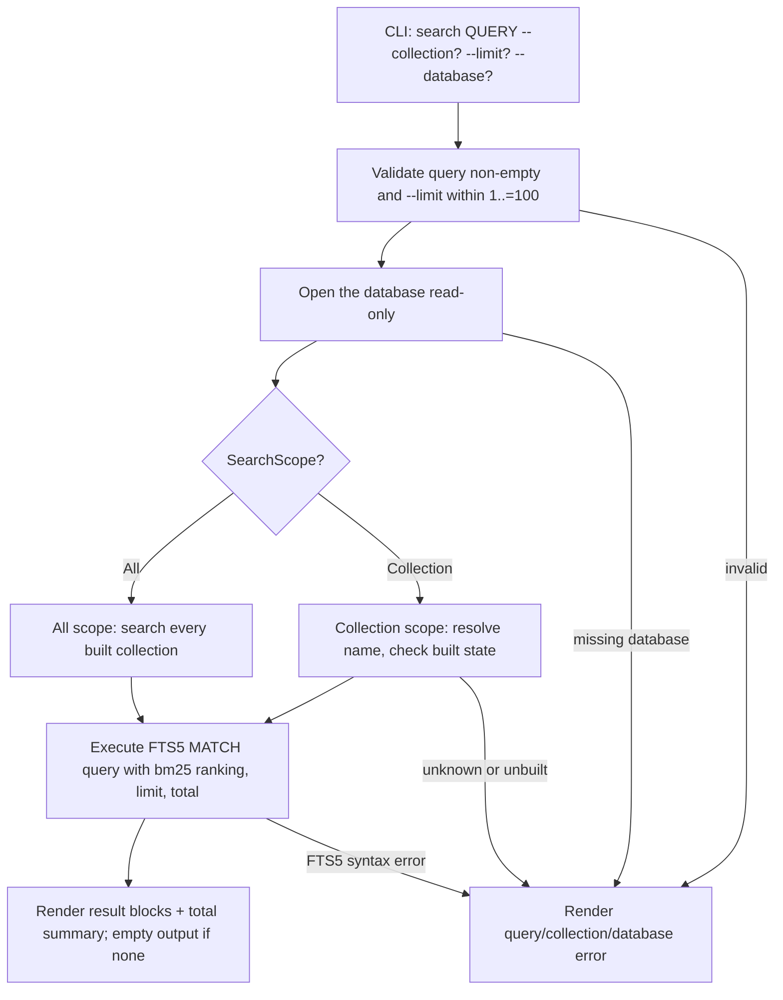

# Design

## Context And Constraints

This feature adds the dedicated lexical search command that queries the per-passage
FTS5 index built by `US-006` and returns passages ranked by BM25 relevance. The
implementation must preserve the approved behavior in `REQ-007` while respecting
the PRD constraints:

- The application is a local-first Rust single binary.
- All Rust implementation must comply with `specs/CONSTITUTION.md`.
- Search is read-only: it must not alter the index, the stored files, or the
  collections, and it must work offline.
- The default database is `~/.mdsearch/collections.db`, with `--database PATH`
  as an override.
- The query is full FTS5 match syntax; malformed queries fail with a clear error.
- Only built indexes are searched; unbuilt collections are skipped in all-mode
  and fail when explicitly targeted.
- FTS5 `bm25()` is the approved ranking mechanism (ADR-001).
- No schema change, no migration, no new dependency, and no new workspace member
  are required: search reads the schema-v3 tables (`passages`, `passage_files`,
  `files`, `collections`, `lexical_index_state`).

## Proposed Design

Add a read-only search port and use case, and render ranked passages in the CLI.

- The domain gains `PassageKind::from_key`, which reconstructs a passage kind
  from its stable stored key (`body`, `title`, `tags`, `aliases`, `summary`).
- The `LexicalSearchStore` port returns `SearchResult` records and a
  `SearchResultSet` carrying the total match count, and accepts a `SearchScope`
  that selects every collection or one named collection.
- The `LexicalSearch` use case validates the query (non-empty) and delegates to
  the store.
- The `SqliteLexicalSearchStore` adapter executes the FTS5 query read-only,
  ranks with the negated `bm25()` score, orders deterministically, applies the
  limit, and reports the total via a window count. It handles pre-v3 databases
  (nothing is built) and maps FTS5 syntax errors to a clear invalid-query error.
- The CLI command `mdsearch search QUERY` renders result blocks and a total
  summary.

## Components And Responsibilities

| Component | Responsibility | Depends on |
| --- | --- | --- |
| `PassageKind::from_key` (domain) | Reconstruct a kind from its stored key | `domain` types |
| `LexicalSearchStore` port | Search built indexes and report results and total | `domain` types |
| `LexicalSearch` use case | Validate the query and delegate to the store | `LexicalSearchStore` |
| `SqliteLexicalSearchStore` (store-sqlite) | Execute the FTS5 query read-only and map errors | `rusqlite` |
| CLI command handler | Accept `search`, validate inputs, render results | CLI parser and use case |

## Interfaces And Contracts

| Interface | Inputs | Outputs | Errors |
| --- | --- | --- | --- |
| `PassageKind::from_key` | `&str` key | `Option<PassageKind>` | None (unknown keys are `None`) |
| `LexicalSearchStore::search` | `&str` query, `usize` limit, `SearchScope` | `SearchResultSet` | `SearchStoreError` |
| `LexicalSearch::execute` | `&str` query, `usize` limit, `SearchScope` | `SearchResultSet` | `SearchError` (`EmptyQuery`, store error) |
| CLI `mdsearch search` | `QUERY`, `--collection NAME?`, `--limit N?` (1..=100, default 10), `--database PATH?` | Result blocks plus a total-count summary; empty output when nothing matches | "query is empty", "invalid query", "collection not found", "index is not built", "database does not exist" |

`SearchResult` carries `collection` (`CollectionName`), `path` (`PathBuf`),
`kind` (`PassageKind`), `text` (`String`), and `score` (`f64`, the negated
`bm25()` value so higher is better). `SearchResultSet` carries `results` and
`total`.

## Data And State Flow

Search never writes: every step reads from the existing database.

## Security, Performance, And Operations

- Security: no network access; the query is bound as a parameter to `MATCH` and
  never concatenated into SQL; FTS5 syntax errors are surfaced as errors, never
  executed.
- Performance: one read-only query per search with a window count, bounded by
  the `--limit`; FTS5 indexing and `bm25()` ranking operate at the PRD collection
  scale.
- Operations: no migration or schema change; the read-only store performs no DDL;
  a database at schema version 2 or older reports no built collections.
- Compatibility: `collection`, `index`, `add`, and `update` behavior is unchanged.

## Alternatives Considered

| Alternative | Why not chosen |
| --- | --- |
| Extend `LexicalIndexStore` with search | Mixes status reading with ranked retrieval; a narrow search port keeps the contracts independent (R-TRT-08) |
| Reuse `SqliteFileStore` for search | The file store is write-oriented and ingestion-focused; search is read-only over the index tables |
| Sort in application code | FTS5 `bm25()` and SQL ordering already provide the approved ranking and deterministic tie-break |
| Run two queries for results and total | One query with `COUNT(*) OVER()` returns both consistently without a second MATCH pass |
| Reject pre-v3 databases on search | Contradicts the approved skip-unbuilt behavior; treating them as having no built collections is consistent |

## Risks And Open Decisions

- FTS5 `MATCH` errors arrive as SQLite failures; the adapter maps failures whose
  message indicates an FTS5 syntax problem to `InvalidQuery` and leaves genuine
  storage failures as `Storage`.
- `-bm25(passages)` yields positive display scores; the exact score formatting is
  a presentation detail outside the requirements contract.
- The `COUNT(*) OVER()` total is computed over the filtered set before `LIMIT`,
  giving the total match count independently of the result cap.
- Unknown stored `kind` keys reconstruct to `None` and are treated as storage
  corruption (an error), since only the four recognized fields and `body` are
  ever written.

## Verification Approach

- Domain: `from_key` round-trips every kind and returns `None` for unknown keys.
- Application: `LexicalSearch` with an in-memory store fake for all and
  collection scopes, empty output, empty-query rejection, and store-error
  propagation.
- Store: integration tests for ranking order, deterministic tie-breaking, the
  limit and total, collection restriction, unknown collection, unbuilt
  collection, pre-v3 databases, malformed queries, and exact-phrase matching.
- CLI: acceptance tests mapped from `scenarios.feature`, including rendering,
  `--limit` bounds, `--collection`, empty and malformed queries, empty output,
  and the missing-database boundary.
- Run every scenario in `scenarios.feature` as an executable acceptance test.
- Run the Rust constitution gates from `specs/CONSTITUTION.md` before marking the
  implementation complete.