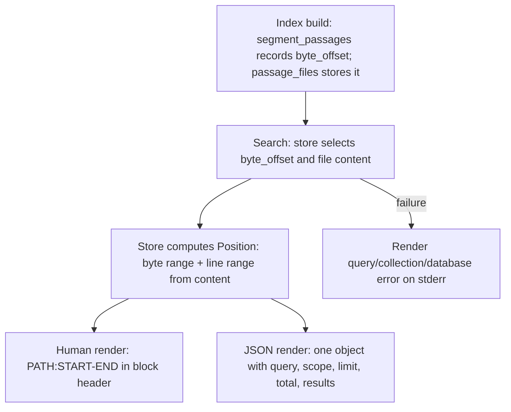

# Design

## Context And Constraints

This feature extends the lexical search command (`US-007`) to report where each
matching passage sits in its source file and to emit a machine-readable JSON
form. The implementation must preserve the approved behavior in `REQ-008` while
respecting the PRD constraints:

- The application is a local-first Rust single binary.
- All Rust implementation must comply with `specs/CONSTITUTION.md`.
- Search remains read-only and offline.
- Positions are computed from each passage's byte offset recorded in the index
  at build time (FR-007).
- The default database is `~/.mdsearch/collections.db`, with `--database PATH`
  as an override.
- `serde` and `serde_json` are already workspace dependencies, so JSON output
  adds no new dependency.
- No new workspace member is required.

## Proposed Design

Record each passage's byte offset in the file at index time, compute the line
and byte ranges at search time, and render them in both output modes.

- The domain `Passage` gains a `byte_offset`; `segment_passages` computes it:
  body paragraphs get structural offsets within the body substring plus the
  body's start offset, and recognized frontmatter fields get the offset of their
  `key:` line within the frontmatter block.
- Schema version 4 adds a `byte_offset` column to `passage_files` via a guarded
  `ALTER TABLE`; the rebuild records each passage's offset. `byte_length` is
  derived from the stored passage text.
- `SearchResult` gains a `Position` value carrying the byte offset, byte length,
  and 1-based inclusive start and end lines. The search store computes the byte
  range from the stored offset and text length, and the line range from the
  file content.
- The CLI renders `PATH:START-END` in the human block header and, with `--json`,
  serializes one JSON object with the query, scope, limit, total, and results.

## Components And Responsibilities

| Component | Responsibility | Depends on |
| --- | --- | --- |
| `Passage::byte_offset` (domain) | Hold a passage's byte offset in its file | `domain` types |
| `segment_passages` (domain) | Compute each passage's byte offset during segmentation | `yaml-rust2` |
| `Position` (application) | Carry byte and line ranges for a result | `domain` types |
| `SearchResult::position` (application) | Expose a result's position | `domain` types |
| `SqliteLexicalSearchStore` (store-sqlite) | Return offsets and compute line ranges from file content | `rusqlite` |
| CLI command handler | Render human headers and serialize `--json` | CLI parser, use case, `serde_json` |

## Interfaces And Contracts

| Interface | Inputs | Outputs | Errors |
| --- | --- | --- | --- |
| `segment_passages` | `&[u8]` content | `(Vec<Passage>, Option<FrontmatterIssue>)`, each passage with a `byte_offset` | None (lenient) |
| `SqliteLexicalSearchStore::search` | `&str` query, `usize` limit, `SearchScope` | `SearchResultSet` with positions | `SearchStoreError` |
| CLI `mdsearch search` | `QUERY`, `--json?`, `--collection?`, `--limit?`, `--database?` | Human blocks with `PATH:START-END` or one JSON object | "query is empty", "invalid query", "collection not found", "index is not built", "database does not exist" |

`Position` carries `byte_offset`, `byte_length`, `line_start`, and `line_end`
(1-based inclusive). The JSON result object mirrors the human fields plus
`position`.

## Data And State Flow

Search never writes; it reads the stored offsets and content to compute positions.

## Security, Performance, And Operations

- Security: no network access; the query remains bound as a parameter; positions
  are derived from stored content, never executed.
- Performance: the search query adds one integer column per result and computes
  line ranges from stored content; line counting is O(file size) per result and
  is bounded at the PRD scale.
- Operations: migration to schema version 4 adds `byte_offset` idempotently via a
  guarded `ALTER TABLE`; existing databases migrate on the next `collection
  update`; search of a pre-v4 database (no offsets) reports positions as absent
  (line range falls back to unknown rather than failing).
- Compatibility: human search output keeps the `N match(es)` summary and empty
  output on zero matches; existing `--limit`, `--collection`, and error behavior
  is unchanged.

## Alternatives Considered

| Alternative | Why not chosen |
| --- | --- |
| Compute positions by searching the file at retrieval time | Fragile for repeated passage text and duplicates the segmentation work; the story commits to index-time offsets |
| Store only a line range instead of a byte offset | Loses the raw byte range required by the JSON contract and by future tooling |
| New migration framework | The existing append-only versioning plus a guarded `ALTER TABLE` is sufficient for one added column |
| Hand-rolled JSON | `serde_json` is already a workspace dependency; reusing it keeps serialization correct and tested |

## Risks And Open Decisions

- Frontmatter field offsets point at their `key:` line; the byte range for a
  multi-line field value is approximate but the line range is still correct for
  locating the field.
- Repeated identical body paragraphs are distinguished by structural offsets
  within the body substring, so each passage is positioned correctly.
- A database that has not been migrated to schema version 4 lacks offsets;
  search falls back to reporting a position with byte length and unknown line
  range rather than failing.
- Exact JSON field names and ordering are outside the requirements contract.

## Verification Approach

- Domain: unit tests for `byte_offset` across body paragraphs, frontmatter
  fields, CRLF content, and empty files.
- Store: integration tests for migration v4, byte and line ranges, the pre-v4
  fallback, and position correctness in results.
- CLI: acceptance tests mapped from `scenarios.feature`, including the human
  `PATH:START-END` header, the `--json` object shape, empty-JSON output, and
  error behavior in both modes.
- Run every scenario in `scenarios.feature` as an executable acceptance test.
- Run the Rust constitution gates from `specs/CONSTITUTION.md` before marking the
  implementation complete.