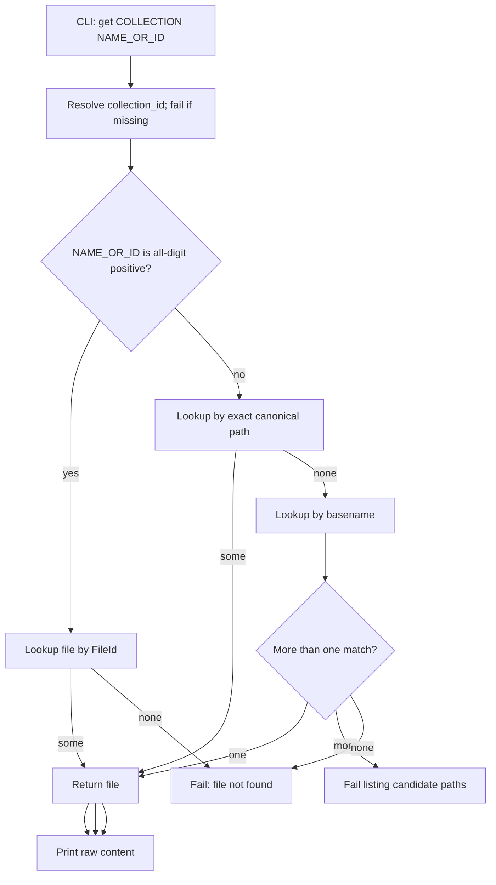

# Design

## Context And Constraints

This feature adds a command that retrieves a complete stored file from a
collection by canonical path, unique basename, or indexing-assigned ID. The
implementation must preserve the approved behavior in `REQ-009` while respecting
the PRD constraints:

- The application is a local-first Rust single binary.
- All Rust implementation must comply with `specs/CONSTITUTION.md`.
- Retrieval is read-only and offline.
- The default database is `~/.mdsearch/collections.db`, with `--database PATH`
  as an override.
- Files are identified by canonical absolute path with a stable `file_id`
  (`US-004`, `US-006`).
- No schema change, no migration, no new dependency, and no new workspace member
  are required: retrieval reads the existing `files` table.

## Proposed Design

Introduce a `FileId` domain value, a read-only retrieval port, and a use case
that resolves a name or ID to one file, then print the raw content.

- The domain gains `FileId(u64)`, a positive newtype validated at construction.
- The `FileRetrievalStore` port returns `RetrievedFile { path, content }` and
  provides three primitives: `get_by_path`, `get_by_id`, and `list_by_basename`.
- The `GetFile` use case parses `NAME_OR_ID` (an all-digit positive argument is
  an ID, otherwise a name), resolves the name by exact path then unique
  basename, and returns the file or a precise error.
- The read-only `SqliteFileRetrievalStore` implements the primitives against
  `files`.
- The CLI command `mdsearch get COLLECTION NAME_OR_ID` prints the raw content.

## Components And Responsibilities

| Component | Responsibility | Depends on |
| --- | --- | --- |
| `FileId` (domain) | Represent a positive indexing-assigned file ID | `domain` types |
| `FileRetrievalStore` port | Look up a stored file by path, ID, or basename | `domain` types |
| `GetFile` use case | Parse and resolve a name or ID to one file | `FileRetrievalStore` |
| `SqliteFileRetrievalStore` (store-sqlite) | Query the `files` table read-only | `rusqlite` |
| CLI command handler | Accept `get`, render content or errors | CLI parser and use case |

## Interfaces And Contracts

| Interface | Inputs | Outputs | Errors |
| --- | --- | --- | --- |
| `FileId::try_from(u64)` | `u64` | `FileId` | `FileIdError::Zero` |
| `FileRetrievalStore::get_by_path` | `&CollectionName`, `&Path` | `Option<RetrievedFile>` | `FileRetrievalStoreError` |
| `FileRetrievalStore::get_by_id` | `&CollectionName`, `FileId` | `Option<RetrievedFile>` | `FileRetrievalStoreError` |
| `FileRetrievalStore::list_by_basename` | `&CollectionName`, `&str` | `Vec<RetrievedFile>` | `FileRetrievalStoreError` |
| `GetFile::execute` | `&CollectionName`, `&str` name or ID | `RetrievedFile` | `GetFileError` (not found, ambiguous, store, non-UTF-8) |
| CLI `mdsearch get` | `COLLECTION`, `NAME_OR_ID`, `--database PATH?` | Raw file content | "file not found", "ambiguous basename with candidates", "collection not found", "database does not exist" |

## Data And State Flow

Retrieval never writes; it reads the stored file content and prints it.

## Security, Performance, And Operations

- Security: no network access; lookups are parameterized SQL; output is the
  stored content, never executed.
- Performance: three indexed queries over `files` per retrieval; bounded at the
  PRD scale.
- Operations: no migration or schema change; the read-only store performs no
  DDL.
- Compatibility: existing commands and the `files` table are unchanged.

## Alternatives Considered

| Alternative | Why not chosen |
| --- | --- |
| Add retrieval methods to `FileStore` | The file store is write-oriented and ingestion-focused; a narrow read-only port keeps the contract focused (R-TRT-08) |
| Resolve ambiguity inside the store | Path-vs-basename and ID-vs-name resolution is business logic; the use case owns it and the store stays a data source |
| Return raw bytes through the CLI string channel | The `run` API returns a `String`; non-UTF-8 content is an explicit error rather than silent corruption |
| Case-insensitive or substring name matching | Out of the approved scope; exact path and unique basename are sufficient and predictable |

## Risks And Open Decisions

- Non-UTF-8 stored content cannot be represented in the CLI string output; such
  content fails with a clear error. Markdown is UTF-8, so this is an edge case.
- A numeric-looking basename (for example `2024`) is always treated as a file
  ID; this matches the approved digit-to-ID rule.
- `file_id` values come from SQLite `INTEGER PRIMARY KEY` autoincrement and are
  positive in practice; `FileId` rejects zero defensively.

## Verification Approach

- Domain: `FileId` accepts positive values, rejects zero, and round-trips.
- Application: `GetFile` with an in-memory fake store covering path, unique
  basename, ID, ambiguous basename, not-found by name, not-found by ID, and
  collection-not-found.
- Store: integration tests for the three primitives against a real database.
- CLI: acceptance tests mapped from `scenarios.feature`, including raw-content
  output and every error boundary.
- Run every scenario in `scenarios.feature` as an executable acceptance test.
- Run the Rust constitution gates from `specs/CONSTITUTION.md` before marking the
  implementation complete.