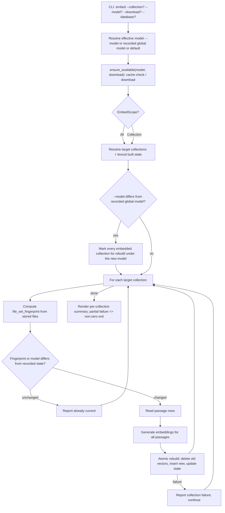

# Design

## Context And Constraints

This feature adds the dedicated `mdsearch embed` command that builds and
maintains a per-passage semantic (vector) index over the passages the lexical
index already covers. The implementation must preserve the approved behavior in
`REQ-010` while respecting the PRD and constitution constraints:

- The application is a local-first Rust single binary; embedding works offline
  by default and the network is used only when `--download` is passed.
- All Rust implementation must comply with `specs/CONSTITUTION.md`.
- The default database is `~/.mdsearch/collections.db`, with `--database PATH`
  as an override.
- `embed` requires a built lexical index per collection (REQ-011, REQ-012);
  embedding reuses the lexical index's passage set.
- `update` fully rebuilds the lexical index on every run (ADR-005), destroying
  and recreating FTS5 passage rowids even when file content is unchanged.
  Semantic vectors therefore key to a stable logical passage identity
  `(file_id, kind, position)` instead of the physical passage rowid, so a
  no-op `update` does not invalidate the semantic index.
- Vectors are stored in the vendored `sqlite-vector` extension in the same
  SQLite file (ADR-001, ADR-003).
- Embeddings are generated locally by `fastembed` with the approved default
  model `all-MiniLM-L6-v2` (384 dimensions, cosine metric).
- Model availability is validated before any collection work; a missing local
  model fails clearly unless `--download` is passed (REQ-009, REQ-010).
- A single global embedding model is recorded in the database; a `--model`
  switch rebuilds every collection with an existing semantic index (REQ-006,
  REQ-007).

## Proposed Design

Add an embedding generator port, a semantic index store port, a use case, a
CLI command, a `fastembed` adapter crate, and a schema-v5 migration.

- The domain gains `EmbeddingModel` (a validated non-empty model name),
  `Embedding` (a `Vec<f32>` vector), `SemanticPassage` (file, kind, position,
  text), and a pure `file_set_fingerprint` function that hashes a collection's
  stored file set so staleness can be detected without re-reading disk.
- The `EmbeddingGenerator` port (application) exposes model availability checks
  and text embedding; the `SemanticIndexStore` port (application) exposes the
  global model, per-collection semantic state, passage reads, and an atomic
  per-collection rebuild.
- The `EmbedCollections` use case validates the model, resolves the target
  collections, applies staleness and model-change logic, and produces a
  per-collection report.
- The `FastembedGenerator` adapter (new crate `crates/adapters/embed-fastembed`)
  implements the generator with `fastembed`, gating downloads behind
  `--download` and mapping model names to fastembed's supported models.
- The `SqliteSemanticIndexStore` adapter implements the store with a schema-v5
  migration: a `settings` table for the global model, `semantic_index_state`
  per collection, and an `embeddings` vector virtual table with metadata
  columns keyed to the logical passage identity.
- The CLI adds `mdsearch embed [--collection NAME] [--model NAME] [--download]
  [--database PATH]` and renders the per-collection summary.

## Components And Responsibilities

| Component | Responsibility | Depends on |
| --- | --- | --- |
| `EmbeddingModel`, `Embedding`, `SemanticPassage` (domain) | Value types for models, vectors, and passages to embed | `domain` types |
| `file_set_fingerprint` (domain) | Hash a collection's stored file set for staleness | `ContentHash`, `std` |
| `EmbeddingGenerator` port | Check model availability (with optional download) and embed texts | `domain` types |
| `SemanticIndexStore` port | Read/write global model, per-collection state, passage rows; atomic rebuild | `domain` types |
| `EmbedCollections` use case | Validate model, resolve targets, apply staleness/model-change logic, report | `EmbeddingGenerator`, `SemanticIndexStore`, `Clock` |
| `FastembedGenerator` (embed-fastembed) | Implement the generator with `fastembed`, cache-check, download gating | `fastembed`, `EmbeddingGenerator` |
| `SqliteSemanticIndexStore` (store-sqlite) | Implement the store over schema-v5 tables | `rusqlite`, `sqlite-vector` |
| CLI command handler | Accept `embed`, validate inputs, render summary, signal partial failure | CLI parser and use case |

## Interfaces And Contracts

| Interface | Inputs | Outputs | Errors |
| --- | --- | --- | --- |
| `EmbeddingGenerator::ensure_available` | `&EmbeddingModel`, `download: bool` | `()` | `UnsupportedModel`, `ModelNotCached`, `DownloadFailed`, `Storage` |
| `EmbeddingGenerator::embed` | `&EmbeddingModel`, `&[&str]` texts | `Vec<Embedding>` | `EmbeddingError` |
| `SemanticIndexStore::targets` | — | `Vec<EmbedTarget>` (collection, has files, lexical built) | `SemanticIndexStoreError` |
| `SemanticIndexStore::resolve` | `&CollectionName` | `EmbedTarget` | `CollectionNotFound`, `SemanticIndexStoreError` |
| `SemanticIndexStore::global_model` | — | `Option<EmbeddingModel>` | `SemanticIndexStoreError` |
| `SemanticIndexStore::set_global_model` | `&EmbeddingModel` | `()` | `SemanticIndexStoreError` |
| `SemanticIndexStore::status` | `&CollectionName` | `Option<SemanticIndexStatus>` (fingerprint, model, passage count, embedded at) | `SemanticIndexStoreError` |
| `SemanticIndexStore::embedded_collections` | — | `Vec<CollectionName>` | `SemanticIndexStoreError` |
| `SemanticIndexStore::passages` | `&CollectionName` | `Vec<SemanticPassage>` | `SemanticIndexStoreError` |
| `SemanticIndexStore::file_set_fingerprint` | `&CollectionName` | `ContentHash` | `SemanticIndexStoreError` |
| `SemanticIndexStore::rebuild` | `&CollectionName`, `&EmbeddingModel`, `Timestamp`, `&[(SemanticPassage, Embedding)]` | `usize` (passage count) | `SemanticIndexStoreError` |
| `EmbedCollections::execute` | `EmbedScope` (all / one collection), `Option<&EmbeddingModel>`, `download: bool` | `EmbedReport` (per-collection outcomes) | `EmbedError` (`UnsupportedModel`, `ModelNotCached`, `DownloadFailed`, `CollectionNotFound`, `IndexNotBuilt`, store/generator/clock errors) |
| CLI `mdsearch embed` | `--collection NAME?`, `--model NAME?`, `--download`, `--database PATH?` | Per-collection summary lines plus model used; partial-failure output and non-zero exit | "model not supported", "model not available; pass --download", "download failed", "collection not found", "index is not built", "database does not exist" |

`EmbedReport` carries one `EmbedOutcome` per processed collection: `Embedded`
with the passage count, `AlreadyCurrent`, `Skipped` with a reason (no files,
lexical index not built), or `Failed` with a message. `EmbedScope` selects every
collection or one named collection.

## Data And State Flow

Preconditions that abort the whole command: an unsupported model, a model that
is not cached locally without `--download`, and a failed download. Per-collection
failures during the rebuild are reported and processing continues. Each
collection's rebuild is atomic in one transaction.

## Security, Performance, And Operations

- Security: no network access unless `--download` is explicitly passed; model
  assets are read from a local cache; passages are bound as parameters and never
  concatenated into SQL.
- Performance: embedding is CPU-bound inference over the collection's passage
  set, done once per rebuild; a full rebuild is O(passages), consistent with the
  PRD's unbounded indexing-time constraint. The vector table is searched only in
  the next EPIC-004 slice.
- Operations: schema v5 is applied by an idempotent migration when the store is
  opened for embedding; the global model and per-collection state record what
  was built and with which model, enabling the next slice's staleness reporting.
- Compatibility: `collection`, `index`, `add`, `update`, `search`, and `get`
  behavior is unchanged; existing databases migrate forward in place.

## Alternatives Considered

| Alternative | Why not chosen |
| --- | --- |
| Key vectors to the physical FTS5 passage rowid | `update` rebuilds the lexical index every run (ADR-005), so rowids change even when content is unchanged; vectors would silently dangle. The logical `(file_id, kind, position)` key is stable across no-op updates |
| Embed per document instead of per passage | Rejected in the story: semantic and lexical search must return identical passages for fusion |
| Rebuild the semantic index inside `collection update` | Rejected in the story: `embed` is a separate explicit command, keeping `update` lexical-only |
| Store the global model per collection | Rejected in the story: a single global model guarantees database-wide vector comparability; a `--model` switch rebuilds all embedded collections |
| Always rebuild, never skip | The story requires reporting already current and skipping unchanged collections |
| Re-read files from disk during `embed` | Rejected in the story: staleness compares the stored file set (content hashes), not the on-disk state |

## Risks And Open Decisions

- The vendored `sqlite-vector` virtual table must support predicate deletes
  (`DELETE FROM embeddings WHERE collection_id = ?`); the adapter tests must
  exercise rebuild-after-rebuild before this slice is complete.
- `fastembed` model asset layout in the cache must be inspected at implementation
  time so the availability check matches fastembed's actual cache directory
  structure; the exact cache layout is adapter-internal.
- A `--model` switch rebuilds every collection with an existing semantic index
  regardless of `--collection` scope (REQ-007); the report must reflect all
  collections rebuilt, not only the targeted one.
- Partial per-collection failure must surface a non-zero exit code while still
  printing the summary; the CLI maps a report containing `Failed` outcomes to a
  distinct exit path.
- The default model `all-MiniLM-L6-v2` is the approved starting point; model
  choice is revisited through the ADR-004 evaluation framework.

## Verification Approach

- Domain: `EmbeddingModel` validation, `Embedding` construction, `SemanticPassage`
  accessors, and `file_set_fingerprint` determinism and change-detection
  (including a total-order sort keyed on `(path, content hash)` so the
  fingerprint is deterministic even for duplicate paths).
- Application: `EmbedCollections` with in-memory fakes for every scope, model
  availability, staleness, model-switch rebuild-all, skip and fail paths, and
  report shaping.
- Store: integration tests for global model get/set, status read/write,
  passage reads, fingerprint computation, atomic rebuild (success and rollback),
  rebuild-after-rebuild, wrong-dimension rejection, and predicate delete against
  the vector table. The vector table metadata columns must be declared with
  double quotes (the vendored parser strips double quotes but not single quotes).
- Generator adapter: model availability, download gating, unsupported-model
  mapping, the approved 384-dimensional default model, and the hf-hub cache
  layout availability check. Real inference requires the model assets and is
  exercised manually/offline rather than in CI (no network in tests).
- CLI: acceptance tests mapped from `scenarios.feature` for the offline-reachable
  paths (missing database, unsupported model, uncached model suggesting
  `--download`), plus unit tests for the per-collection summary rendering and
  partial-failure exit.
- Run every offline-reachable scenario in `scenarios.feature` as an executable
  acceptance test; the remaining scenarios (which require model assets) are
  covered at the application layer with fakes.
- Run the Rust constitution gates from `specs/CONSTITUTION.md` before marking the
  implementation complete.
