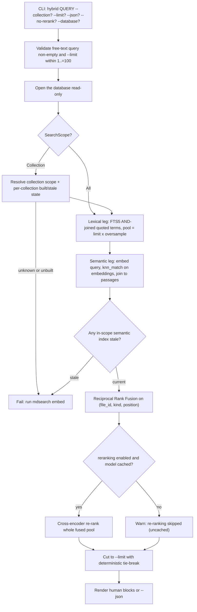

# Design

## Context And Constraints

This feature adds the dedicated `mdsearch hybrid QUERY` command that retrieves
candidate passages from both the lexical (FTS5/BM25) index and the semantic
(sqlite-vector) index, fuses them with Reciprocal Rank Fusion, and re-ranks the
whole fused pool with a local cross-encoder model. The implementation must
preserve the approved behavior in `REQ-011` while respecting the PRD and
constitution constraints:

- The application is a local-first Rust single binary; hybrid search works
  offline by default and never initiates a network request.
- All Rust implementation must comply with `specs/CONSTITUTION.md`.
- The default database is `~/.mdsearch/collections.db`, with `--database PATH`
  as an override.
- The hybrid query is free text with no FTS5 operators (REQ-011 FR-002); the
  lexical leg maps the free-text query to an FTS5 `AND`-joined quoted-term
  match.
- The command is read-only: it must not alter indexes, stored files,
  collections, settings, or the database.
- Stale semantic indexes fail the command with guidance to run `mdsearch embed`
  (REQ-011 FR-010); staleness compares the stored file-set fingerprint.
- Re-ranking is on by default and disabled by `--no-rerank`; an uncached
  re-ranker falls back to RRF-only with a warning (REQ-011 FR-005, FR-006).
- Re-ranker provisioning extends the already-implemented `embed` command with
  `--reranker NAME` (REQ-011 FR-017); this slice revises `REQ-010` and
  `DES-010` to record that extension.
- `fastembed` 6.0.0 already ships `TextRerank` for cross-encoder re-ranking, so
  no new dependency is required (ADR-007).

## Proposed Design

Add a domain RRF fusion function and free-text query mapper, a `Reranker` port,
a `HybridSearchStore` port, a `HybridSearch` use case, a read-only hybrid
search store adapter, a re-ranker adapter in the existing `embed-fastembed`
crate, and a `--reranker` extension to `mdsearch embed`.

- The domain gains `RerankerModel` (a validated non-empty model name), a pure
  `reciprocal_rank_fusion` function that fuses two ranked candidate lists keyed
  on the logical passage identity `(file_id, kind, position)`, and a pure
  free-text-to-FTS5 mapper that quotes each whitespace-separated term and joins
  them with `AND`.
- The `Reranker` port (application) mirrors the `EmbeddingGenerator` contract:
  model availability checks and (query, document) re-scoring.
- The `HybridSearchStore` port (application) resolves the search scope, checks
  per-collection semantic staleness, and returns oversampled lexical and
  semantic candidate lists carrying the logical passage identity and per-leg
  scores.
- The `HybridSearch` use case validates the query, resolves the scope, checks
  staleness, retrieves the candidates, fuses with RRF, optionally re-ranks the
  whole fused pool, cuts to `--limit`, and produces a hybrid result set.
- The `SqliteHybridSearchStore` adapter reuses the schema-v5 tables: the FTS5
  `passages`/`passage_files` join for the lexical leg and the `embeddings`
  vector table `knn_match` query joined back to `passage_files`/`files`/
  `collections` for the semantic leg. Staleness compares the current stored
  file-set fingerprint against `semantic_index_state`.
- The `FastembedReranker` adapter (in the existing `embed-fastembed` crate)
  implements the `Reranker` port with `fastembed::TextRerank`, gating downloads
  behind the embed provisioning path and mapping model names to fastembed's
  supported re-ranker set.
- `mdsearch embed` gains `--reranker NAME`; the provisioning validates the
  model, checks or downloads its assets, and records the global
  `reranker_model` setting in the `settings` table.

## Components And Responsibilities

| Component | Responsibility | Depends on |
| --- | --- | --- |
| `RerankerModel` (domain) | Validated non-empty re-ranker model name | `domain` types |
| `reciprocal_rank_fusion` (domain) | Fuse two ranked candidate lists into one RRF-ranked list keyed on passage identity | `domain` types |
| Free-text-to-FTS5 mapper (domain) | Quote each whitespace-separated term and join with `AND` | `std` |
| `Reranker` port | Check model availability and re-score (query, document) pairs | `domain` types |
| `HybridSearchStore` port | Resolve scope, check staleness, retrieve oversampled lexical and semantic candidates | `domain` types |
| `HybridSearch` use case | Validate query, resolve scope, check staleness, retrieve, fuse, re-rank, cut | `HybridSearchStore`, `Reranker` |
| `SqliteHybridSearchStore` (store-sqlite) | Read-only candidate retrieval over schema-v5 tables | `rusqlite`, `sqlite-vector` |
| `FastembedReranker` (embed-fastembed) | Implement the `Reranker` port with `fastembed::TextRerank` | `fastembed`, `Reranker` |
| CLI command handler | Accept `hybrid`, validate inputs, render human/JSON results | CLI parser and use case |
| `embed --reranker` extension | Validate and provision the re-ranker model; record the global setting | CLI parser, `Reranker`, semantic store |

## Interfaces And Contracts

| Interface | Inputs | Outputs | Errors |
| --- | --- | --- | --- |
| `Reranker::ensure_available` | `&RerankerModel`, `download: bool` | `()` | `UnsupportedModel`, `ModelNotCached`, `DownloadFailed`, `Storage` |
| `Reranker::rerank` | `&RerankerModel`, `&str` query, `&[&str]` documents | `Vec<f64>` scores | `RerankError` |
| `HybridSearchStore::candidates` | `&str` fts5 query, `&str` free text, `usize` pool, `SearchScope` | `HybridCandidates` (lexical list, semantic list) | `CollectionNotFound`, `IndexNotBuilt`, `StaleSemanticIndex`, `Storage` |
| `HybridSearch::execute` | `&str` query, `usize` limit, `SearchScope`, `&Option<RerankerModel>`, rerank enabled | `HybridResultSet` | `EmptyQuery`, `CollectionNotFound`, `IndexNotBuilt`, `StaleSemanticIndex`, `Storage`, reranker error |
| CLI `mdsearch hybrid` | `QUERY`, `--collection NAME?`, `--limit N?` (1..=100, default 10), `--json`, `--no-rerank`, `--database PATH?` | Result blocks (rank, path, kind, text, ordering score) plus a shown-count summary; `--json` includes re-ranker/fused/BM25/cosine scores and provenance | "query is empty", "collection not found", "index is not built", "semantic index is stale; run mdsearch embed", "database does not exist" |
| CLI `mdsearch embed --reranker NAME` | `--reranker NAME`, `--download` | Global `reranker_model` setting recorded; assets fetched when needed | "model not supported", "model not available; pass --download", "download failed" |

`HybridCandidate` carries the logical passage identity (`file_id`, `kind`,
`position`), the collection, file path, passage text, and the per-leg score
(negated BM25 for the lexical leg, cosine similarity for the semantic leg).
`HybridResultSet` carries the final ranked results and the ordering score per
result (re-ranker score when used, else fused RRF score).

## Data And State Flow

The semantic leg embeds the query with the recorded global embedding model; the
lexical leg builds the `AND`-joined quoted-term FTS5 match from the same free
text. A collection with no semantic index contributes to the lexical leg only;
its passages are still re-ranked when the re-ranking stage runs. Search never
writes.

## Security, Performance, And Operations

- Security: no network access at query time; the re-ranker model and the
  embedding model come from the local cache; the FTS5 match is built from
  quoted terms bound as a parameter and never concatenated into SQL; free-text
  characters that are FTS5 operators become literal quoted terms.
- Performance: retrieval is bounded by the per-leg oversample pool (3 x limit)
  and the final `--limit` cut; re-ranking is cross-encoder inference over the
  fused pool, the dominant cost, and is bounded by the pool size and `--limit`
  (the re-ranker scores the whole pool, but the pool is capped by the oversample
  factor). Query embedding reuses the existing embedding pipeline.
- Operations: no migration and no schema change; the `reranker_model` key lives
  in the existing `settings` table. Re-ranker assets are provisioned ahead of
  time via `mdsearch embed --reranker NAME --download`; the first cached run is
  the fallback-and-warn path.
- Compatibility: `collection`, `index`, `add`, `update`, `search`, `get`, and
  `embed` behavior is unchanged except for the documented `embed --reranker`
  extension; existing databases require no migration.

## Alternatives Considered

| Alternative | Why not chosen |
| --- | --- |
| Weighted normalized-score fusion | Requires calibrating BM25 and cosine scores into one scale per collection; rank-based RRF avoids calibration and is the established hybrid default (ADR-007) |
| Re-rank only semantic candidates | Story requires re-ranking the whole fused pool (REQ-011 FR-004) so lexical-only-fallback passages are ordered by the same signal |
| Re-rank only the top-N fused candidates | Story requires the whole fused pool to be re-scored; the pool is already bounded by the oversample factor |
| Extend `LexicalSearchStore` or `SemanticIndexStore` with hybrid retrieval | Those ports serve single-leg contracts; a dedicated `HybridSearchStore` keeps the two-leg candidate retrieval and staleness check together and read-only |
| No re-ranking stage | The user added a cross-encoder re-ranker as a second stage to the approved story |
| Embed the raw free text for the lexical leg | Adjacent FTS5 terms form a phrase by default; quoting each term and joining with `AND` gives the approved all-terms-must-match behavior |
| Fetch re-ranker assets via `hybrid --download` | The user selected embed-provisioning so one command owns model asset provisioning (REQ-011 FR-017) |

## Risks And Open Decisions

- `knn_match` returns distance for the cosine metric; the adapter must convert
  distance to a similarity score (`1 - distance`) consistently and verify the
  sign against the vendored `sqlite-vector` extension before completion.
- The re-ranker score for `bge-reranker-base` is a relevance logit; the exact
  presentation (raw, negated, or scaled) is a formatting detail outside the
  requirements contract.
- A stale semantic index fails the whole command even when the user asked for a
  single non-stale collection scope; the failure message names the stale
  collection and directs the user to `mdsearch embed`.
- Re-ranker inference latency scales with the fused pool; the oversample factor
  (3 x limit) bounds it, and the value is tunable through the ADR-004
  evaluation framework.
- The free-text mapper must strip or quote FTS5 operator characters so a query
  containing `AND` or quotes is treated as literal text, not syntax.
- This slice revises `REQ-010` and `DES-010` to add the `embed --reranker`
  extension; those revisions must be approved before the embed code changes.

## Verification Approach

- Domain: `RerankerModel` validation, `reciprocal_rank_fusion` determinism,
  rank contribution, tie-breaking, and change detection; the free-text mapper
  quotes terms, joins with `AND`, and neutralizes FTS5 operator characters.
- Application: `HybridSearch` with in-memory fakes for every scope, staleness
  detection, lexical-only fallback, RRF fusion, re-rank on/off, uncached
  re-ranker warning, no-match, and empty-query rejection.
- Store: integration tests for lexical-leg retrieval, semantic-leg `knn_match`
  retrieval and distance-to-similarity conversion, stale-fingerprint
  comparison, unknown collection, unbuilt lexical index, and deterministic
  ordering.
- Adapter: `FastembedReranker` availability, download gating, unsupported-model
  mapping, and score shape; real inference is exercised offline rather than in
  CI (no network in tests).
- CLI: acceptance tests mapped from `scenarios.feature` for the offline-reachable
  paths (missing database, unknown collection, unbuilt index, stale index,
  empty query, `--limit` bounds, fallback-and-warn), plus unit tests for
  rendering and `--json` shape.
- Run every offline-reachable scenario in `scenarios.feature` as an executable
  acceptance test; scenarios requiring real model assets are covered at the
  application layer with fakes.
- Run the Rust constitution gates from `specs/CONSTITUTION.md` before marking
  the implementation complete.
