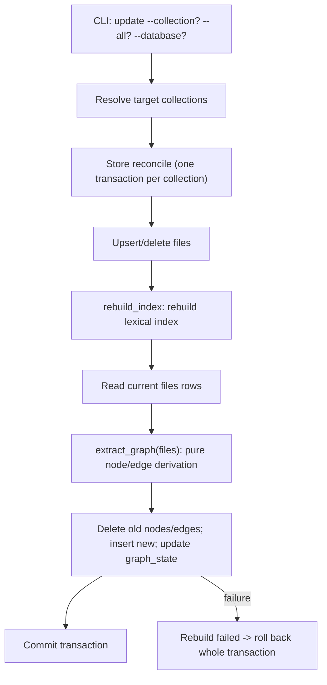

# Design

## Context And Constraints

This feature folds the deterministic entity graph build into `mdsearch update`
and provides an internal query layer plus a debug CLI. The implementation must
preserve the approved behavior in `REQ-012` while respecting PRD and
constitution constraints:

- Local-first single Rust binary; the build is fully offline and deterministic
  with no LLM (FR-017).
- All Rust implementation complies with `specs/CONSTITUTION.md`.
- The graph lives in the same SQLite database file as the lexical and semantic
  indexes (ADR-001); default path `~/.mdsearch/collections.db`, `--database
  PATH` override.
- The build folds into `mdsearch update` (FR-001) and is transactional per
  collection (FR-018), sharing the existing `reconcile` transaction that
  upserts/deletes files and rebuilds the lexical index (ADR-005).
- Graph storage is plain SQLite `nodes`/`edges` tables traversed with recursive
  CTEs; the query surface is `async_graphql` added as a new workspace
  dependency (ADR-008), in-process only, no server exposed (DEC-009).
- Frontmatter parsing exists in the domain (`passage.rs`): `title`, `tags`,
  `aliases`, `summary` are recognized. This slice adds parsing of `related:`
  and `sources:` and of inline relative `.md` links for graph edges.
- Node identity is stable: file nodes use the indexing-assigned `FileId`
  (US-006); tag and alias nodes use their normalized name plus node type.

## Proposed Design

Add a domain graph extraction module, a `GraphStore` read port, a graph rebuild
step inside the existing SQLite `reconcile` transaction, a schema-v6 migration,
an `async_graphql` internal query layer, and a debug CLI command.

- The domain gains a pure `extract_graph` function over the collection's stored
  files that produces an `EntityGraph` (nodes + edges). It parses each file's
  frontmatter (`tags:`, `aliases:`, and newly `related:`, `sources:`) and body
  for inline relative `.md` links, resolving link and `related:`/`sources:`
  targets against the collection's file set and skipping unresolved targets
  (FR-010).
- The `GraphStore` port (application) exposes the read side: node lookup,
  filtered neighbor expansion, and hop-limited traversal with a cycle guard. It
  is read-only and used by the debug CLI and the internal query layer.
- The SQLite adapter's `reconcile` runs a `rebuild_graph` step after
  `rebuild_index` in the same transaction: it reads the current `files` rows,
  calls `extract_graph`, deletes the collection's old nodes/edges, inserts the
  new ones, and updates `graph_state` (FR-001, FR-011, FR-018).
- The store adapter implements `GraphStore` over the `nodes`/`edges` tables with
  recursive CTEs.
- The `app` crate wires the debug CLI `mdsearch graph neighbors ID` and the
  `async_graphql` resolvers that query the `GraphStore` port (FR-014).

## Components And Responsibilities

| Component | Responsibility | Depends on |
| --- | --- | --- |
| `EntityKind` (domain) | Node type discriminator: File, Tag, Alias | `domain` types |
| `RelationKind` (domain) | Closed edge-type set: LinksTo, TaggedWith, AliasOf, RelatedTo, HasSource | `domain` types |
| `GraphNode`, `GraphEdge` (domain) | Value types for graph nodes and edges with stable identity | `domain` types |
| `EntityGraph` (domain) | Container for a collection's nodes and edges | `domain` types |
| `extract_graph` (domain) | Pure, deterministic extraction of nodes/edges from the file set | `passage` parsing, `FileId`, `std` |
| `GraphStore` port (application) | Node lookup, filtered neighbor expansion, hop-limited traversal | `domain` types |
| `rebuild_graph` (store-sqlite) | Rebuild a collection's graph in the `reconcile` transaction | `extract_graph`, SQLite |
| `SqliteGraphStore` (store-sqlite) | Implement the read port with recursive CTEs | `rusqlite` |
| Schema-v6 migration (store-sqlite) | Add `nodes`, `edges`, `graph_state` tables | SQLite |
| `async_graphql` resolvers (app) | In-process typed query layer over `GraphStore` | `async_graphql`, `GraphStore` |
| Debug CLI handler (app) | `mdsearch graph neighbors ID` shell inspection | `GraphStore` |

## Interfaces And Contracts

| Interface | Inputs | Outputs | Errors |
| --- | --- | --- | --- |
| `extract_graph` (domain) | `&[(FileId, &Path, &[u8])]` stored files | `EntityGraph` (nodes + edges) | Pure; returns `EntityGraph` (unresolved refs skipped, never fails) |
| `GraphStore::node` | `&CollectionName`, node ID | `Option<GraphNode>` | `GraphStoreError` (`CollectionNotFound`, `DatabaseNotFound`, `Storage`) |
| `GraphStore::neighbors` | `&CollectionName`, node ID, `Option<RelationKind>`, depth | `Vec<Neighbor>` (node, relation, depth) | `GraphStoreError` |
| `GraphStore::traverse` | `&CollectionName`, node ID, `Option<RelationKind>`, `max_hops` | `Vec<Neighbor>` with cycle guard | `GraphStoreError` |
| SQLite `rebuild_graph` | collection id, `&[FileRecord]`-derived file rows | `usize` (node count) / `()` | `FileStoreError` (rolls back on failure) |
| CLI `mdsearch graph neighbors` | `ID`, optional `--collection NAME`, optional `--database PATH` | Neighbor list with relation types and depths; empty when none | "database does not exist", "collection not found", "node not found" |

## Data And State Flow

Preconditions that abort the whole command: the database does not exist, or a
targeted `--collection` does not exist. Per-collection graph rebuild failure
rolls back that collection's transaction, leaving its previous graph intact
(FR-018). The debug CLI `mdsearch graph neighbors` is read-only and separate.

## Security, Performance, And Operations

- Security: the build is fully local with no network or LLM; frontmatter and
  link targets are parsed from stored content; graph writes use bound
  parameters and never concatenate SQL.
- Performance: graph extraction is ingestion-time only and linear in the file
  set; recursive-CTE traversal of 1-3 hops is sub-millisecond at 100-5,000
  documents. Build is unconstrained (PRD indexing-time is irrelevant).
- Operations: schema v6 is applied by an idempotent migration when the store is
  opened; the `graph_state` table records what was built (fingerprint, counts,
  timestamp) for diagnostics and later staleness handling.
- Compatibility: `collection`, `add`, `update`, `search`, `embed`, `hybrid`, and
  `get` behavior is unchanged; existing databases migrate forward in place.
- The `async_graphql` layer exposes no server; it is an internal in-process
  surface only (DEC-009), with its dependency features trimmed.

## Alternatives Considered

| Alternative | Why not chosen |
| --- | --- |
| A dedicated graph database or separate graph file | Violates the one-database-file constraint and adds a component; recursive CTEs suffice at this scale |
| Standalone `mdsearch graph` build command | Rejected in the story: the build folds into `mdsearch update` |
| Incremental UPSERT + tombstone graph maintenance | Rejected in the story: full deterministic rebuild on every update is idempotent and auto-cleans stale nodes |
| LLM claim extraction for typed conceptual edges | Rejected in the story: this slice is the deterministic structure graph with zero LLM cost |
| Plain port/recursive-CTE API only, no async-graphql | The user chose to add `async_graphql` now (ADR-008) to honor ADR-001/DEC-009 |
| Key graph nodes to physical file rowids | File nodes use the stable indexing-assigned `FileId`; physical rowids change on rebuild |

## Risks And Open Decisions

- The `async_graphql` crate (currently `8.0.0-rc.5` on crates.io) is a release
  candidate; its features must be trimmed to the in-process surface and its
  license/advisory gates validated before merge. The exact pinned version is a
  design-time detail.
- Inline `.md` link parsing (relative links, `[text](target.md)`, link
  normalization) must be defined precisely at implementation time; unresolved
  and absolute/URL links are skipped.
- `related:` and `sources:` frontmatter parsing must tolerate the same YAML
  shapes as `tags:`/`aliases:` (scalar list, inline list) to avoid regressions;
  reuse the existing `field_text`/frontmatter extraction.
- Alias and tag nodes with identical names remain distinct rows (FR-013);
  node identity is `(type, normalized name)` for non-file nodes and `FileId`
  for file nodes, so no accidental merge occurs.
- The `rebuild_graph` step runs inside `reconcile`, which the lexical index also
  uses; it must not change lexical behavior (out of scope).
- The debug CLI is read-only and must not mutate graph state.

## Verification Approach

- Domain: `extract_graph` over representative files covering all five edge types
  (links, tags, aliases, related, sources), unresolved-reference skipping,
  tag/alias collision distinctness, and determinism; node/edge value-type
  construction and identity rules.
- Application: `GraphStore` port contract with an in-memory fake covering node
  lookup, filtered neighbor expansion, and hop-limited traversal with a cycle
  guard, plus error paths (unknown node, unknown collection, missing database).
- Store: integration tests for schema-v6 migration, graph rebuild inside
  `reconcile` (build, rebuild idempotency, stale-node removal after file
  deletion, empty-collection empty graph, rollback on failure), and
  `SqliteGraphStore` read queries against real tables.
- App: acceptance tests mapped from `scenarios.feature` for the offline-reachable
  paths (debug neighbor listing, missing database, unknown node/collection);
  the `async_graphql` resolvers are exercised in-process against the store.
- Run the Rust constitution gates from `specs/CONSTITUTION.md` before marking
  the implementation complete.
