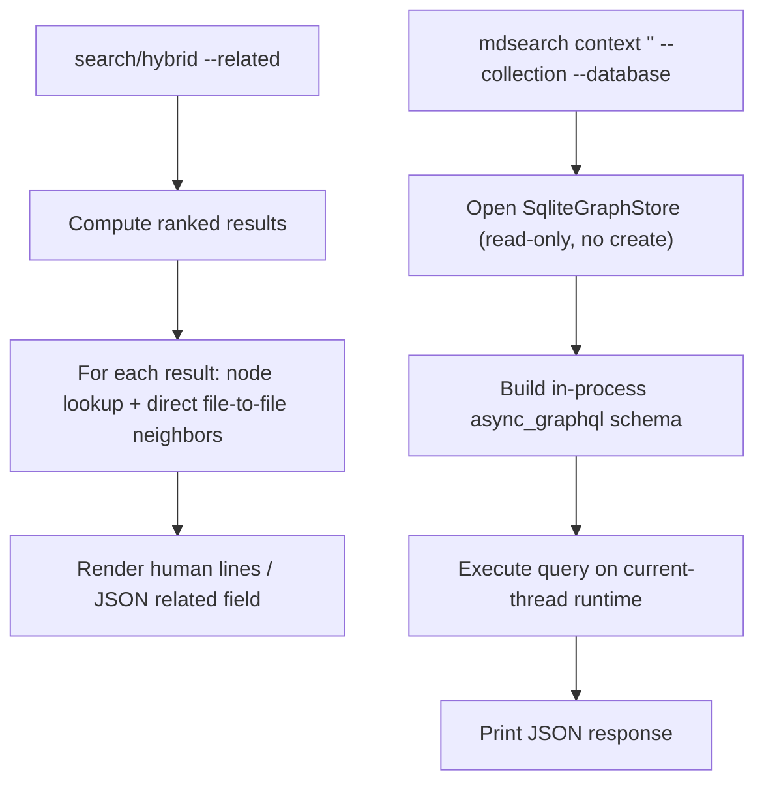

# Design

## Context And Constraints

This feature exposes the EPIC-005 entity graph through retrieval (REQ-013): a
`--related` switch on `search`/`hybrid` enriches each result with its
file-to-file related links, and a dedicated `mdsearch context '<query>'` command
executes in-process GraphQL queries over the entity graph. The implementation
must preserve the approved behavior in `REQ-013` while respecting PRD and
constitution constraints:

- Local-first single Rust binary; both surfaces are read-only and offline with
  no LLM or network access (FR-011).
- All Rust implementation complies with `specs/CONSTITUTION.md`.
- Both surfaces drive the entity graph already built by `mdsearch update`
  (EPIC-005): the `GraphStore` read port, `SqliteGraphStore`, and the
  in-process `async_graphql` schema from `ADR-008`.
- `--related` must not change ranked results (FR-004); it only adds per-result
  context, inheriting the invoking command's `--collection`/`--database` scope
  (FR-005).
- `mdsearch context` requires `--collection` and honors `--database` (FR-007).
- No new crate, workspace member, architectural layer, or dependency is
  introduced; the design reuses the approved EPIC-005 components.

## Proposed Design

Add a `--related` switch to `search`/`hybrid` and a new `mdsearch context`
subcommand, both built on the existing `GraphStore` port and in-process
`async_graphql` schema:

- `search`/`hybrid` gain an optional `--related` flag. When set, the composition
  root also opens a `SqliteGraphStore`; after computing the result set, each
  result's file node is looked up and its direct file-to-file neighbors are read
  through the port. The human and JSON renderers then include that related
  context per result.
- A new `mdsearch context '<query>'` subcommand opens the `SqliteGraphStore`,
  builds the internal schema with the existing `build_schema`/`handle` helpers,
  executes the positional GraphQL query on a current-thread tokio runtime, and
  prints the JSON response.

File node identity follows EPIC-005: a file node is keyed by its canonical path
(`NodeId::new(EntityKind::File, path)`), so `--related` builds the node id from
`result.path()`.

## Components And Responsibilities

| Component | Responsibility | Depends on |
| --- | --- | --- |
| CLI args (`cli.rs`) | Add `mdsearch context QUERY --collection --database` and `--related` on search/hybrid args | `clap` |
| Related enrichment (app) | For each result, resolve its file node and read direct file-to-file neighbors; filter to File destinations and `LINKS_TO`/`RELATED_TO`/`HAS_SOURCE` | `GraphStore` port, `NodeId` |
| Renderers (`run.rs`) | Human `related: <path> (<RELATION>)` lines; JSON `related` array per result | related enrichment |
| Context command (`run.rs`) | Open store, build schema, execute positional GraphQL query, print JSON | `build_schema`/`handle`, `SqliteGraphStore` |

## Interfaces And Contracts

| Interface | Inputs | Outputs | Errors |
| --- | --- | --- | --- |
| `related_for(path)` (app helper) | Result file path | `Vec<(PathBuf, RelationKind)>` of direct file-to-file links, deduplicated | None (missing node or graph → empty) |
| `search`/`hybrid --related` renderers | Result set + related context per result | Human lines or JSON with `related` field | Unchanged from existing commands |
| `mdsearch context '<query>'` | GraphQL query string, `--collection NAME` (required), `--database PATH` | JSON response of the executed query | Missing `--collection`, database does not exist (no file created), collection not found, node not found, malformed GraphQL |
| GraphQL schema (reused) | `node(collection, kind, key)` and `neighbors(collection, kind, key, relation?, maxHops)` | Node or neighbor JSON | GraphQL errors mapped from `GraphStoreError` |

## Data And State Flow

Both paths are read-only: no graph, database, or file is mutated. The context
command opens the database without initializing it, so a missing database fails
without creating a file (FR-010).

## Security, Performance, And Operations

- Security: fully local with no network or LLM; graph reads use the existing
  bound-parameter SQLite statements; the GraphQL schema is in-process only with
  no server or network endpoint exposed.
- Performance: `--related` adds one bounded hop-1 query per result over the
  indexed `edges` tables; context queries are bounded by their submitted
  `maxHops`. No explicit latency budget (DEC-012).
- Operations: no new storage, migration, or runtime service; both surfaces read
  the graph already built by `update`. Missing graph or node yields an empty
  related set rather than a failure (FR-012).
- Compatibility: `search`, `hybrid`, and their existing output are unchanged
  without `--related`; the `related` JSON field is additive.

## Alternatives Considered

| Alternative | Why not chosen |
| --- | --- |
| A new dedicated context query API separate from `GraphStore` | The EPIC-005 port already exposes node lookup and neighbor expansion; adding a layer would duplicate it |
| Three relation-filtered neighbor queries per result | A single unfiltered hop-1 query filtered in the app is one bounded query and simpler to reason about |
| A dedicated `mdsearch context` GraphQL schema | The internal schema (node + neighbors) is the approved query surface and already satisfies the story (US-013) |
| `--related` as a standalone command | The story places it as a switch on `search`/`hybrid` so context rides along with ranked retrieval |

## Risks And Open Decisions

- File nodes are keyed by canonical path (EPIC-005 implementation), so
  `--related` relies on `result.path()` matching the stored `node_key`; a
  mismatch yields an empty related set, never a wrong link.
- The JSON `related` serialization (OQ-001) is resolved here as a structured
  array of `{ "path", "relation" }` objects, which is the most usable shape for a
  coding-agent harness.
- Both surfaces depend on the graph being built (a prior successful `update`);
  there is no on-demand graph build in this slice.

## Verification Approach

- Unit: the related-enrichment filter (File destinations, closed relation set,
  deduplication, empty on missing node) and the JSON `related` rendering.
- App acceptance: scenarios from `scenarios.feature` mapped to CLI runs —
  `--related` human/JSON output on search and hybrid, unchanged ranked results,
  `mdsearch context` neighbors/node lookup, missing `--collection`, unknown node,
  malformed query, and missing database without file creation.
- Run the Rust constitution gates from `specs/CONSTITUTION.md` (`cargo xtask ci`)
  before marking the implementation complete.
