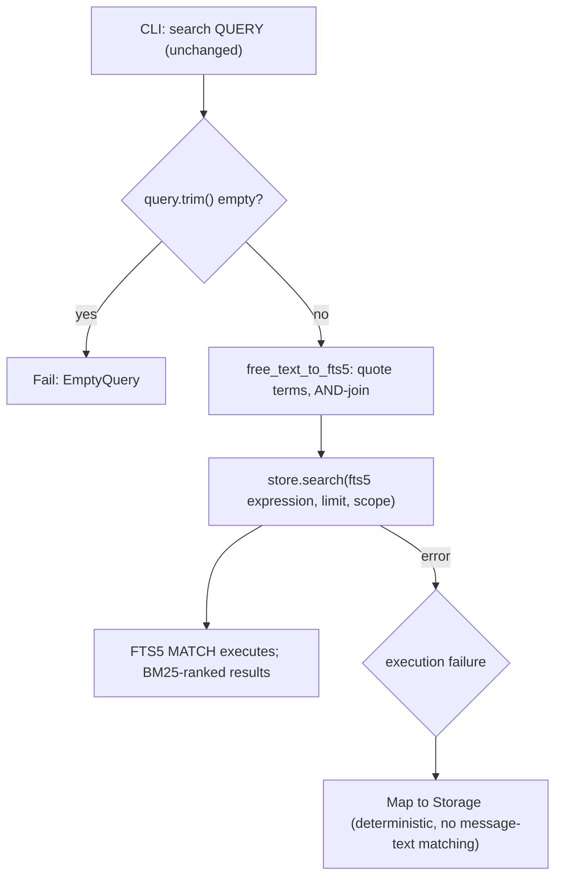

# Design

## Context And Constraints

EPIC-008 unifies query interpretation across the two retrieval commands:
`mdsearch search QUERY` and `mdsearch hybrid QUERY` must treat the query as the
same literal free text, with FTS5 operator characters inert and an empty or
whitespace-only query failing clearly (`REQ-014`).

Today the lexical path hands `args.query` verbatim to the store's FTS5 `MATCH`
clause (`crates/app/src/run.rs:274`,
`crates/application/src/lexical_search.rs:34`,
`crates/adapters/store-sqlite/src/lib.rs:900`), so operator characters act as
syntax. The hybrid path already neutralizes the query through the domain mapper
`free_text_to_fts5` (`crates/domain/src/fusion.rs:132`) before building its
lexical leg (`crates/application/src/hybrid_search.rs:199`). The asymmetry is
an oversight: the domain already owns and unit-tests the neutralization
behavior (OBS-001), and the approved decision is to reuse it on the lexical
path (DEC-013, ADR-009).

`REQ-014` FR-006 additionally requires deterministic `InvalidQuery`
classification — independent of engine error-message text (OBS-003) — kept as
defense-in-depth and unreachable for normal input.

The constitution governs the implementation: no new crate, workspace member,
architectural layer, or dependency (R-AGT-02); the domain stays pure
(R-DIR-02); ports are defined in `application` (R-TRT-04); adapters are thin
(R-SEP-04); tests come first (R-TST-01); and the `REQ-007`/007 scenario
revisions already approved as part of this feature stay in lockstep
(R-SDD-05).

## Proposed Design

Two changes, one shared rule:

1. The `SearchLexical` use case applies the existing domain mapper before
   calling the store, mirroring `HybridSearch::execute` exactly:
   - Keep the `query.trim().is_empty()` guard returning `SearchError::EmptyQuery`
     (existing behavior and tests).
   - `let fts5_query = free_text_to_fts5(query)`; the mapper cannot return
     `None` after the guard, so the `ok_or(EmptyQuery)` arm is defense-in-depth.
   - Call `self.store.search(&fts5_query, limit, scope)` with the neutralized
     expression.
2. The store's `search_query_failure` (`crates/adapters/store-sqlite/src/lib.rs:1614-1623`)
   stops classifying failures by matching `"fts5"` in the engine's message
   text. The neutralizer output is syntactically valid FTS5 by construction —
   every term is a quoted phrase, embedded quotes are doubled, terms are
   `AND`-joined — so query-path execution failures map to
   `SearchStoreError::Storage`. The `InvalidQuery` variants in
   `SearchStoreError` and `SearchError` remain in the public error enums as
   defense-in-depth but are not constructed for normal input (FR-006).

No CLI change (`run.rs` still passes `args.query`), no port signature change,
no schema or migration, and no new dependency.

## Components And Responsibilities

| Component | Responsibility | Depends on |
| --- | --- | --- |
| `SearchLexical::execute` (application) | Validate non-empty query, neutralize via the domain mapper, delegate to the store | `free_text_to_fts5`, `LexicalSearchStore` |
| `free_text_to_fts5` (domain, existing) | Quote each whitespace-separated term, double embedded quotes, join with `AND` | `std` |
| `SqliteLexicalSearchStore::search` (adapter, existing) | Execute the neutralized FTS5 expression, rank by BM25 | `rusqlite` |
| `search_query_failure` (adapter, revised) | Map execution failures deterministically to `Storage` without message-text matching | `rusqlite` |
| CLI `search` command handler (app, unchanged) | Pass `args.query` to the use case, render results | `SearchLexical` |

## Interfaces And Contracts

| Interface | Inputs | Outputs | Errors |
| --- | --- | --- | --- |
| `SearchLexical::execute` | `&str` query, `usize` limit, `SearchScope` | `SearchResultSet` | `EmptyQuery`, store errors |
| `LexicalSearchStore::search` | `&str` neutralized FTS5 expression, `usize` limit, `SearchScope` | `SearchResultSet` | `CollectionNotFound`, `IndexNotBuilt`, `Storage`; `InvalidQuery` retained but unreachable |
| `search_query_failure` | `rusqlite::Error` | `SearchStoreError` | `Storage` for all execution failures |

The port contract doc for `LexicalSearchStore::search` is updated to state that
the query argument is a neutralized expression and that `InvalidQuery` is
defense-in-depth.

## Data And State Flow

The same mapper produces the expression used by the hybrid command's lexical
leg; both commands therefore interpret the identical query string identically.
The command never writes.

## Security, Performance, And Operations

- Security: the neutralized expression is bound as a parameter (existing
  behavior); quoting makes FTS5 operator characters literal, so a user query
  cannot inject operator syntax. No new input surface is added.
- Performance: neutralization is an in-memory transformation O(terms); no
  additional I/O or queries are introduced by the change.
- Operations: no migration and no schema change; existing databases are
  unaffected. The ADR-004 evaluation is the release gate: `cargo xtask eval`
  re-runs before and after the change and the recorded baseline is updated if
  scores shift, with the PRD-001 quality targets (Recall@5 >= 0.85, MRR@5 >=
  0.70, NDCG@5 >= 0.75) still met.
- Compatibility: hybrid search behavior is unchanged; `search` results change
  only for queries whose raw interpretation differed from literal semantics
  (operator characters), which is the intended behavior; CLI switches and
  output shapes are unchanged.

## Alternatives Considered

| Alternative | Why not chosen |
| --- | --- |
| Neutralize inside `SqliteLexicalSearchStore::search` | Puts query semantics in the adapter (R-SEP-04) and would diverge from the hybrid use case, which owns neutralization in `application`; the port would silently change meaning |
| Keep classification with a tighter `"fts5:"` message prefix | Still message-text dependent; fails FR-006's determinism requirement |
| Classify via rusqlite error variant or SQLite extended result code | FTS5 syntax errors surface as generic `SQLITE_ERROR` with no distinct extended code; they cannot be distinguished from storage failures by code alone |
| Pre-validate the query structurally in the store (balanced quotes, no bare operators) | Redundant: the neutralizer output is valid FTS5 by construction; a second validation site invites drift |
| Neutralize in the CLI (`run.rs`) | Composition layer must not own domain logic; the use case is the correct boundary (mirrors hybrid) |

## Risks And Open Decisions

- `InvalidQuery` becomes effectively unreachable API surface. The approved
  contract keeps it as defense-in-depth, but the existing store test
  `reports_a_malformed_query` (`crates/adapters/store-sqlite/tests/lexical_search.rs:261`)
  asserts the old behavior and must be replaced with a regression test for
  literal operator semantics.
- Eval scores may shift for queries containing hyphens or question marks
  (OBS-001 open question 3, resolved: re-baseline). If re-running the golden
  set breaches a target, work stops and the shift is investigated before the
  baseline is updated — quality is the PRD's top priority.
- The validity-by-construction claim rests on FTS5 accepting any quoted
  phrase; it is verified by a property-style domain test plus store
  integration tests covering operator-character inputs.
- Story OQ-001 (classification mechanism) is resolved by this design:
  validation-by-construction through the domain mapper.

## Verification Approach

- Domain: existing neutralizer unit/property tests remain; add a property test
  that arbitrary free text (including operator characters, quotes, and
  whitespace) maps to an expression that never produces an FTS5 query error.
- Application: `SearchLexical` tests with in-memory fakes — literal operator
  semantics, empty and whitespace-only query rejection, and identical passage
  sets for the same query string across `search` and `hybrid` fakes.
- Store: replace `reports_a_malformed_query` with regression tests that
  neutralized operator-character queries execute with literal semantics and
  that execution failures map deterministically to `Storage`.
- CLI: execute the offline-reachable scenarios from `scenarios.feature`
  (identical passages, operator literals, empty/whitespace rejection) as
  acceptance tests.
- Evaluation: run `cargo xtask eval` before the change to record the baseline,
  re-run after, and update the recorded baseline only if scores shift and the
  ADR-004 targets still hold.
- Run the constitution gates from `specs/CONSTITUTION.md` (R-TOOL-04) and
  observe red-then-green on the new tests (R-TST-01) before marking the
  implementation complete.