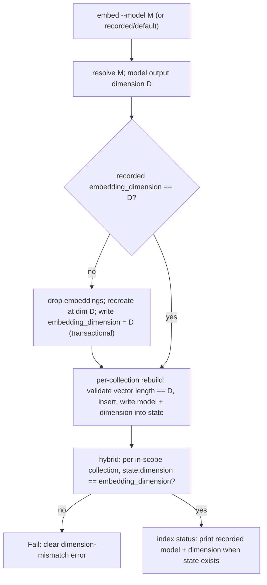

# Design

## Context And Constraints

EPIC-009 makes the semantic index dimension-aware: every supported fastembed
model — including the advertised 1024-dimension `bge-large-en-v1.5` and
`multilingual-e5-large` — must embed, rebuild, and search without a dimension
error; the model name and dimension are recorded per collection; and reads
validate the recorded dimension (`REQ-015`).

Today the schema is pinned to 384: the `embeddings` virtual table is created
with `dim=384`, `EMBEDDING_DIMENSION = 384` guards every `rebuild` insert
(`crates/adapters/store-sqlite/src/lib.rs:41,180-185,1338`), and selecting a
1024-dimension model fails only at the first rebuild with a storage-level
"embedding dimension mismatch" (OBS-002).

The approved product decision (DEC-014) and the physical-layout decision
(ADR-010) fix the semantics: each collection records the model and dimension
that built its vectors; the vector store is one shared `embeddings` table
recreated at the active model's dimension on a model switch; all collections
share the active dimension; legacy state without a recorded dimension is
treated as 384.

The constitution governs the implementation: no new crate, workspace member,
architectural layer, or dependency (R-AGT-02); the domain stays pure
(R-DIR-02); ports are defined in `application` (R-TRT-04); adapters are thin
(R-SEP-04); tests come first (R-TST-01); and `REQ-010`, `REQ-011`, and
`REQ-006` are revised in lockstep (R-SDD-05).

## Proposed Design

Four changes in the SQLite adapter plus two small surfaces:

1. **Active dimension in `settings`.** The embed store records the active
   embedding dimension under the `embedding_dimension` key (`TABLE-007`) when
   it creates the vector table. Absent (legacy) means 384, matching the
   pre-existing table. `EMBEDDING_DIMENSION` is removed; the dimension is
   derived from the resolved model's output dimension at table creation.

2. **Dimension-aware table lifecycle.** `create_embeddings_table` creates the
   `embeddings` virtual table at the active dimension. When a model switch
   changes the active dimension, the embed flow (which already rebuilds every
   embedded collection, REQ-010 FR-007) drops the existing `embeddings` table
   and recreates it at the new dimension before the per-collection rebuilds.
   The change is applied transactionally with the settings update: the table
   recreation and the `embedding_dimension` write commit together.

3. **Per-collection dimension recording.** `semantic_index_state` gains a
   `dimension` column (`TABLE-008`) via an `ALTER TABLE ... ADD COLUMN
   dimension INTEGER` migration with a schema-version bump. `rebuild` writes
   the model's dimension alongside the model name; legacy NULL rows are read
   as 384. The `rebuild` insert guard compares the vector length to the active
   dimension instead of the constant and keeps the explicit mismatch error.

4. **Read-time validation.** The `hybrid` semantic leg resolves each in-scope
   collection's recorded dimension and compares it with the active
   `embedding_dimension`; a disagreement fails the command with a clear
   dimension-mismatch error before any results are returned. `index status`
   reports the recorded model and dimension for collections with a semantic
   state row, and reports nothing extra for collections without one.

No CLI switch changes, no new dependency, and no domain-layer change are
required: `EmbeddingModel` already carries the model name, and the
embed-fastembed adapter exposes the model's output dimension at session
construction (the dimension used by the generator to embed).

## Components And Responsibilities

| Component | Responsibility | Depends on |
| --- | --- | --- |
| `EmbeddingGenerator::embed` (embed-fastembed, existing) | Return vectors at the model's output dimension; the adapter surfaces the dimension of the built session | `fastembed` |
| `SqliteSemanticIndexStore` (store-sqlite) | Create the `embeddings` table at the active dimension; record `embedding_dimension` in settings; write `dimension` into `semantic_index_state` at rebuild; validate vector lengths against the active dimension | `rusqlite`, `sqlite-vector` |
| `SqliteHybridSearchStore` (store-sqlite) | Validate each in-scope collection's recorded dimension against the active dimension before the semantic leg runs | `rusqlite` |
| `ReadIndexStatus` / `render_index_status` (application/app) | Include the recorded semantic model and dimension in the status line when a semantic state row exists | `IndexStatus` use case, semantic state |
| Schema migration | Add `semantic_index_state.dimension`; bump the schema version; record `embedding_dimension` on next table creation | `migrate` in store-sqlite |

## Interfaces And Contracts

| Interface | Inputs | Outputs | Errors |
| --- | --- | --- | --- |
| `SemanticIndexStore::rebuild` | `&CollectionName`, `&EmbeddingModel`, `Timestamp`, `&[(SemanticPassage, Embedding)]` | `usize` embedded count | `CollectionNotFound`, `Storage` (dimension mismatch included, naming the expected and actual dimensions) |
| `SemanticIndexStore::active_dimension` (internal) | — | `i64` active dimension from settings, 384 when absent | `Storage` |
| Hybrid semantic leg | scope + recorded state | ranked candidates | `Storage`; dimension mismatch fails before results |
| `mdsearch index status` | `--database PATH?` | per-collection lines; embedded collections include the model and dimension | unchanged |

The adapter derives the model's output dimension from the resolved
`FastembedModel`; the semantic store receives it via the rebuild flow's model
argument and the settings write, so no new port method is required beyond the
existing surface.

## Data And State Flow

A model switch therefore always lands in a consistent state: the shared table's
dimension, the settings key, and every rebuilt collection's recorded dimension
agree. Reads validate before returning anything.

## Security, Performance, And Operations

- Security: no new input surface; vector lengths are validated against the
  recorded active dimension before insert and before read.
- Performance: validation is an integer comparison per collection plus a
  per-vector length check at rebuild; no additional queries on the read path.
- Operations: one additive migration (`semantic_index_state.dimension`, schema
  version bump) and one new `settings` key; existing 384-dimension databases
  need no rebuild and no data movement. A model switch is the only destructive
  table operation, and it occurs exactly when every embedded collection is
  rebuilt anyway (REQ-010 FR-007); a crash mid-switch leaves the previous table
  and state intact because the settings write commits with the table
  recreation, and re-running `embed` completes the switch.
- Compatibility: `embed`/`hybrid`/`index status` output shapes change only by
  the documented additions (model/dimension reporting, dimension error text);
  hybrid ranking and fusion are untouched.

## Alternatives Considered

| Alternative | Why not chosen |
| --- | --- |
| One vector table per dimension (`embeddings_384`, `embeddings_1024`, ...) | No user value from mixed-dimension coexistence; adds table naming, query routing, and cleanup complexity (ADR-010) |
| One vector table per collection | Table explosion at PRD scale (5,000 docs/collection); complicates the global model switch |
| Keep a fixed 384 dimension and reject other models | Contradicts the approved DEC-014 product decision (advertised models must work) |
| Introspect the table's dimension via `vector_index_info` on every read | Relies on extension internals; the recorded settings key is deterministic and testable |

## Risks And Open Decisions

- The table recreation on model switch must not orphan vectors: it is scoped to
  the switch path where every embedded collection is rebuilt immediately
  afterwards (REQ-010 FR-007); the settings write commits with the recreation.
- Legacy state rows (NULL `dimension`) are read as 384; a legacy database whose
  table was somehow created at a non-384 dimension would fail the read
  validation loudly rather than silently misreport — acceptable and tested.
- The exact `FastembedModel`-to-dimension mapping lives in the embed-fastembed
  adapter and is verified by integration tests for each supported model.
- No open decisions remain; story OQ-001 (legacy handling) and OQ-002 (table
  layout) are resolved by this design and ADR-010.

## Verification Approach

- Store: integration tests — rebuild at 1024 dimensions succeeds and `status`
  reports it; rebuild after a model switch recreates the table at the new
  dimension with state updated; legacy NULL dimension is read as 384; a
  recorded dimension disagreeing with the active dimension fails `hybrid`
  before results; the rebuild guard names expected and actual dimensions.
- Application: `embed` use case with fakes — model-switch flow triggers table
  recreation once and rebuilds every embedded collection; hybrid read
  validation with dimension mismatch; status rendering.
- CLI: acceptance tests mapped from `scenarios.feature` for the
  offline-reachable paths (1024-dim embed via fakes at the application layer,
  status reporting, mismatch error, legacy behavior).
- Evaluation: `cargo xtask eval` re-runs unchanged (the golden set uses the
  default model); no baseline shift is expected.
- Run the constitution gates from `specs/CONSTITUTION.md` (R-TOOL-04) and
  observe red-then-green on the new tests (R-TST-01) before marking the
  implementation complete.