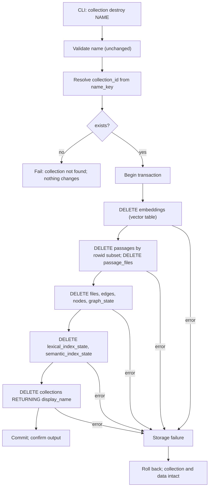

# Design

## Context And Constraints

EPIC-010 makes `mdsearch collection destroy` remove every trace of a
collection: stored files, FTS5 passages, passage mappings, vectors, graph
nodes and edges, and all index-state rows, in one atomic transaction
(`REQ-016`).

Today `SqliteCollectionStore::destroy_collection`
(`crates/adapters/store-sqlite/src/lib.rs:314`) executes only
`DELETE FROM collections WHERE name_key = ?1`. SQLite does not enforce the
declared `ON DELETE CASCADE` clauses because `PRAGMA foreign_keys = ON` is
never executed on connection open, and the virtual tables (`passages` FTS5,
`embeddings` sqlite-vector) cannot declare foreign keys at all. Destroying a
collection therefore orphans its rows permanently, and a later collection can
reuse the freed rowid and inherit the stale data (OBS-008).

The approved product decision (DEC-015) and ADR-011 fix the semantics:
cleanup is an explicit per-table delete list executed in one transaction, with
no reliance on foreign-key cascades; `PRAGMA foreign_keys = ON` remains a
separate observation (OBS-011); the database file and freed space are not
touched (no VACUUM).

The constitution governs the implementation: no new crate, workspace member,
architectural layer, or dependency (R-AGT-02); tests come first (R-TST-01);
and `REQ-003` is revised in lockstep (R-SDD-05).

## Proposed Design

One change in `SqliteCollectionStore::destroy_collection`:

1. Resolve the `collection_id` from `name_key` (case-insensitive, existing
   lookup). Not found → `CollectionNotFound` (unchanged contract).
2. Open one transaction and delete the collection's rows from every
   per-collection table in a fixed order that keeps the FTS5 virtual table
   consistent:
   - `embeddings` (sqlite-vector; has `collection_id` metadata),
   - `passages` by rowid subset
     (`WHERE rowid IN (SELECT passage_rowid FROM passage_files WHERE collection_id = ?)`),
     then `passage_files`,
   - `files`, `edges`, `nodes`, `graph_state`, `lexical_index_state`,
     `semantic_index_state`,
   - finally `collections` with `RETURNING display_name` for the existing
     confirmation output.
3. Commit; any failure rolls back the whole destroy, leaving the collection
   and its data intact (atomicity, REQ-016 FR-002).

The `settings` table is global and never touched. The database file itself is
not deleted and no VACUUM runs (REQ-016 FR-007).

## Components And Responsibilities

| Component | Responsibility | Depends on |
| --- | --- | --- |
| `SqliteCollectionStore::destroy_collection` | Resolve the collection, delete its rows from all ten per-collection tables in one transaction, commit or roll back | `rusqlite` |
| `DestroyCollection` use case (application, unchanged) | Name validation and error mapping | `CollectionStore` |
| CLI destroy command (app, unchanged) | Render the confirmation output | `DestroyCollection` |

## Interfaces And Contracts

| Interface | Inputs | Outputs | Errors |
| --- | --- | --- | --- |
| `CollectionStore::destroy_collection` | `&CollectionName` | `CollectionName` (the destroyed display name) | `CollectionNotFound`, `Storage` |
| CLI `mdsearch collection destroy NAME` | `NAME`, optional `--database PATH` | Human-readable confirmation naming the destroyed collection | unchanged from `REQ-003` |

The port signature is unchanged; only the adapter's implementation changes.

## Data And State Flow

Every per-collection table is enumerated explicitly, so no partial cleanup is
possible and the rowid-reuse hazard is eliminated by construction.

## Security, Performance, And Operations

- Security: no new input surface; the delete list is parameter-bound by
  `collection_id`; no dynamic SQL.
- Performance: deletes are index-driven per collection; the FTS5 rowid-subset
  delete is bounded by the collection's passage count. This replaces zero
  work with one transaction of ~10 statements — negligible at PRD scale.
- Operations: no migration, no schema change, and no new dependency; existing
  databases are unaffected. Destroy remains irreversible (as today), now
  completely so.
- Compatibility: the CLI surface, error contract, and confirmation output from
  `REQ-003` are unchanged; other collections are untouched; the database file
  is not shrunk.

## Alternatives Considered

| Alternative | Why not chosen |
| --- | --- |
| Rely on `ON DELETE CASCADE` with `PRAGMA foreign_keys = ON` | Virtual tables cannot declare foreign keys, so `passages` and `embeddings` would remain orphaned; the PRAGMA is deferred to OBS-011 anyway |
| SQLite triggers to cascade deletes | Implicit cleanup is hard to audit and maintain; the explicit list is deterministic and testable (ADR-011) |
| Keep the status quo (delete only `collections`) | Leaves permanent orphans and the rowid-inheritance corruption hazard (OBS-008) |

## Risks And Open Decisions

- FTS5 deletion must target the rowid subset before `passage_files` rows are
  removed; the fixed delete order handles this and is verified by the
  emptiness integration tests.
- The `embeddings` table may not exist (fresh databases created after the
  dimension-aware change); the delete statement must tolerate a missing
  virtual table — handled by deleting only after a table-existence check or
  by tolerating the error as a no-op for that table.
- No open decisions remain; story OQ-001 (VACUUM) is out of scope.

## Verification Approach

- Store: integration tests asserting SQL-level emptiness of all ten
  per-collection tables after destroy of a fully indexed collection; atomicity
  (injected failure mid-delete leaves the collection intact); rowid-reuse
  safety (destroy then recreate then search/hybrid/graph — no stale rows);
  other collections untouched.
- CLI: existing destroy acceptance tests remain green; a regression scenario
  from `scenarios.feature` for destroy-then-recreate is executed.
- Run the constitution gates from `specs/CONSTITUTION.md` (R-TOOL-04) and
  observe red-then-green on the new tests (R-TST-01) before marking the
  implementation complete.