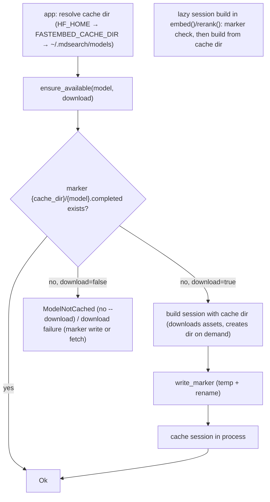

# Design

## Context And Constraints

EPIC-011 makes the model cache a product-owned, predictable location and makes
"downloaded" detection reliable (`REQ-017`): with no environment override,
`--download` stores embedding and re-ranker model assets under
`~/.mdsearch/models`; `HF_HOME` and `FASTEMBED_CACHE_DIR` still win; a model
counts as downloaded iff its completion marker exists, so `embed`/`hybrid`
never advise `--download` for an already-downloaded model.

Today the adapters resolve the cache themselves
(`crates/adapters/embed-fastembed/src/embedding.rs:86-98`,
`rerank.rs:95-106`): `HF_HOME`, then `FASTEMBED_CACHE_DIR`, then a
working-directory `.fastembed_cache` — so the location is CWD-dependent
(OBS-014) — and availability probes the hf-hub layout via `refs/main`
(`embedding.rs:149-160`, `rerank.rs:156-170`), which false-negatives on layout
drift and partial fetches (OBS-015).

The constitution governs the implementation: no new crate, workspace member,
architectural layer, or dependency (R-AGT-02); configuration is read once at
startup in `app` (R-SEP-10); adapters are thin (R-SEP-04); tests come first
(R-TST-01); and `REQ-010`/`REQ-011` stay in force except for the changed cache
semantics (R-SDD-05). The approved decision record is `ADR-012`.

## Proposed Design

Three changes, all inside `app` and the `embed-fastembed` adapters; no port,
domain, or use-case changes:

1. **Resolution moves to `app`.** A small helper (e.g. in `crates/app/src/run.rs`
   or a `model_cache` module in `app`) resolves the cache directory once:
   `HF_HOME` → `FASTEMBED_CACHE_DIR` → `home_directory/.mdsearch/models`. The
   `embed` and `hybrid` command functions resolve it and pass it to the
   adapters. `FastembedGenerator::new` and `FastembedReranker::new` change from
   `Option<PathBuf>` to a required `PathBuf`; the adapters' `effective_cache_dir`
   resolution (including the `.fastembed_cache` fallback) is deleted. `app` is
   the only production caller, so no other call site is affected.

2. **Completion-marker availability in the adapters.** Each adapter keeps a
   per-model marker file `{cache_dir}/{model}.completed` where `{model}` is the
   domain model name. A marker helper module (shared within the
   `embed-fastembed` crate) provides `marker_path(cache_dir, name)`,
   `marker_exists(...)`, and `write_marker(...)` (atomic: write temp file, then
   rename). The hf-hub layout probe (`model_is_cached`) is deleted. Flows:

   - `ensure_available(model, false)`: marker present → `Ok(())` (no session
     build); absent → `ModelNotCached`.
   - `ensure_available(model, true)`: marker present → `Ok(())` (no re-download);
     absent → build session (downloads into the cache dir, created on demand),
     write marker (failure → `DownloadFailed`-class failure, clean, no
     collection touched), cache the session.
   - Lazy session builds in `embed()`/`rerank()`: marker absent → `ModelNotCached`;
     present → build the session from the cache dir.

3. **Documentation.** The `--download` argument help in `crates/app/src/cli.rs`
   and the README state the resolution order and the default location.

No changes to `crates/application` (ports, use cases, errors) or
`crates/domain`.

## Components And Responsibilities

| Component | Responsibility | Depends on |
| --- | --- | --- |
| `model_cache_dir` (app) | Resolve the cache directory once per run: `HF_HOME` → `FASTEMBED_CACHE_DIR` → `~/.mdsearch/models` | `std::env` |
| `embed` / `hybrid` command functions (app) | Pass the resolved cache directory to both adapters | `model_cache_dir` |
| `FastembedGenerator` (embed-fastembed) | Marker-based availability; download writes marker; session lifecycle unchanged | `fastembed`, marker helpers |
| `FastembedReranker` (embed-fastembed) | Same marker contract for re-ranker models | `fastembed`, marker helpers |
| Marker helpers (embed-fastembed) | `marker_path` / `marker_exists` / `write_marker` (atomic) | `std::fs` |
| CLI help + README | Document resolution order and default location | — |

## Interfaces And Contracts

| Interface | Inputs | Outputs | Errors |
| --- | --- | --- | --- |
| `FastembedGenerator::new` | `cache_dir: PathBuf` | generator | — |
| `FastembedReranker::new` | `cache_dir: PathBuf` | reranker | — |
| `marker_path` (internal) | `&Path` cache dir, `&str` model name | `PathBuf` marker path | — |
| `write_marker` (internal) | `&Path` marker path | `()` | `std::io::Error` (temp write or rename) |
| `EmbeddingGenerator::ensure_available` / `Reranker::ensure_available` | `&Model`, `download: bool` | `()` | `UnsupportedModel`, `ModelNotCached`, `DownloadFailed`, `Storage` — unchanged variants and messages |

Port signatures, error variants, and the "pass --download" message text are
unchanged (REQ-017 FR-009).

## Data And State Flow

A download therefore always ends in a consistent state: assets and marker
coexist, and the next run (any working directory, same resolution) finds the
marker and skips both the download and the advice.

## Security, Performance, And Operations

- Security: no new input surface; the marker file is a plain presence flag;
  no network access unless `--download` is passed (unchanged).
- Performance: availability is a single `Path::exists` check; no layout
  scanning, no session construction on the check path.
- Operations: the `.mdsearch` directory gains a `models/` subdirectory created
  on demand; legacy `.fastembed_cache` assets are ignored (one re-download).
  Marker files are small and safe to delete; deleting a marker simply
  re-arms the download advice.
- Compatibility: `embed`/`hybrid` CLI surface and output are unchanged;
  the adapter constructor changes are internal to `app`.

## Alternatives Considered

| Alternative | Why not chosen |
| --- | --- |
| Keep the hf-hub layout probe against the new location | Fragile and version-coupled (ADR-012); the marker is deterministic and testable |
| Resolve the cache next to the `--database` file | Run-dependent location reintroduces the OBS-015 false-positive class |
| Resolve inside the adapters using a home-directory lookup | Violates R-SEP-10; duplicates configuration reading |
| Full-file manifest of every model asset | Over-engineered; the marker contract is the approved DEC-016 semantics |
| Keep `Option<PathBuf>` constructors with a `.fastembed_cache` fallback | The fallback is the bug; making the directory required forces correct composition |

## Risks And Open Decisions

- Marker present but model files deleted externally: treated as downloaded;
  the failure surfaces as a storage error at session build. Accepted tradeoff
  (ADR-012), covered by an edge-behavior note in `REQ-017`.
- The real-download happy path is not exercised in automated tests (no network
  per R-TST-05); it remains covered by the REQ-010 contract tests that already
  gate `--download` behavior, and the marker write is a small, unit-tested
  seam after session build.
- No open decisions remain; story OQ-001 (on-demand creation) and OQ-002
  (marker naming) are resolved by this design and ADR-012.

## Verification Approach

- Adapter unit tests (`embed-fastembed`): `marker_exists`/`write_marker`
  round-trip in a temp dir; `ensure_available(download=false)` returns `Ok`
  when the marker exists (no session build, no network) and `ModelNotCached`
  when absent; the same for the reranker.
- App unit tests: `model_cache_dir` resolution — `HF_HOME` wins over
  `FASTEMBED_CACHE_DIR`, env wins over the home default, no env → `~/.mdsearch/models`.
- CLI integration tests (`crates/app/tests/embed.rs`): unchanged error-path
  behavior (uncached model suggests `--download`; unsupported model fails;
  reranker gating) still passes; the marker-present path is exercised through
  the adapter seam rather than a real download.
- Existing application use-case tests run unchanged (fakes at the ports).
- Documentation: README and `--download` help describe the resolution order.
- Run the constitution gates from `specs/CONSTITUTION.md` (R-TOOL-04) and
  observe red-then-green on the new tests (R-TST-01) before marking the
  implementation complete.