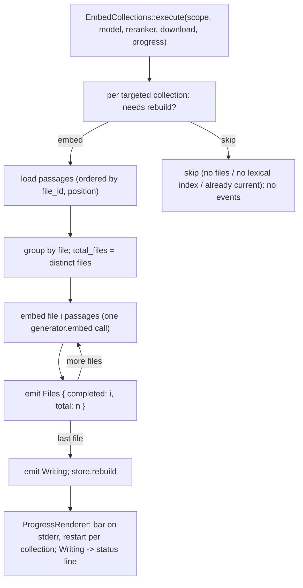

# Design

## Context And Constraints

EPIC-012 makes `mdsearch embed` visibly work during long ingestion runs
(`REQ-018`): per-file progress on stderr during the embedding phase, naming the
collection and the completed/total file counts; a single status message for the
database write phase; stdout report byte-identical; skipped and already-current
collections silent; `--download` unchanged.

Today the embed flow is an all-or-nothing batch
(`crates/application/src/embed_collections.rs:312-323`): all passages are
loaded, embedded in one blocking `generator.embed(model, &texts)` call, then
written via `store.rebuild` (`embed_collections.rs:332-335`), and the CLI
prints only the final report (`crates/app/src/run.rs:706-713`) (OBS-016).

The constitution governs the implementation: no new dependency without human
approval (R-AGT-02 — the `indicatif` dependency was approved by the owner in
this session and is recorded in ADR-013); use cases orchestrate (R-SEP-03);
the stdout contract must not change (R-SDD-05); tests come first (R-TST-01).

## Proposed Design

Three changes:

1. **Progress events in the application layer.** `embed_collections.rs` gains:
   ```rust
   /// A progress event emitted during an embedding run.
   pub enum EmbedProgress {
       /// Per-file progress within a collection's embedding phase.
       Files {
           /// The collection being embedded.
           collection: CollectionName,
           /// Files whose passages have been embedded so far.
           completed_files: usize,
           /// Files with passages in this collection's embedding set.
           total_files: usize,
       },
       /// The collection's vectors are being written to the index.
       Writing {
           /// The collection being written.
           collection: CollectionName,
       },
   }
   ```
   `EmbedCollections::execute` gains a parameter
   `progress: &mut dyn FnMut(EmbedProgress)` threaded into `embed_collection`.
   The embedding phase groups the store-ordered passages (`ORDER BY file_id,
   position`, so alignment is preserved) by file, embeds each file's passages
   with one `generator.embed` call, appends the resulting pairs, and emits
   `Files { completed_files: i, total_files: n }` after each file. Before the
   `store.rebuild` call it emits `Writing`. Skipped and already-current paths
   emit nothing (FR-003).

2. **Stderr renderer in `app`.** New module `crates/app/src/progress.rs`:
   ```rust
   pub(crate) struct ProgressRenderer { bar: Option<ProgressBar>, ... }
   ```
   - `Files { collection, completed, total }`: if the bar's collection
     changed, finalize the previous bar and start a new
     `ProgressBar::with_draw_target(Some(total as u64),
     ProgressDrawTarget::stderr())` with message `embedding {collection}`;
     set position to `completed`.
   - `Writing { collection }`: finalize the current bar
     (`finish_and_clear()`) and write one status line to stderr:
     `writing semantic index for {collection}...` via
     `writeln!(io::stderr().lock(), ...)` (the workspace `print_stderr` lint
     denies only the macro, not `writeln!`).
   - `run.rs::embed` constructs the renderer and passes it to
     `use_case.execute(..., &mut renderer)`; after `execute` returns, any
     in-flight bar is finalized so a failed run never leaves a half-drawn
     progress state (FR-007).

3. **Dependency.** `indicatif = "0.18"` is added to `[workspace.dependencies]`
   and `kv-app` (ADR-013).

No changes to stdout rendering, the `EmbeddingGenerator`/`Reranker` ports, or
the semantic store.

## Components And Responsibilities

| Component | Responsibility | Depends on |
| --- | --- | --- |
| `EmbedCollections` (application) | Emit `EmbedProgress` events; embed per file in passage order | `EmbeddingGenerator` port, semantic store |
| `EmbedProgress` (application) | Event contract: `Files` and `Writing` variants | `CollectionName` |
| `ProgressRenderer` (app) | Render events to stderr with `indicatif`; finalize on run end | `indicatif` |
| `run::embed` (app) | Wire the renderer into `use_case.execute` | `ProgressRenderer`, use case |

## Interfaces And Contracts

| Interface | Inputs | Outputs | Errors |
| --- | --- | --- | --- |
| `EmbedCollections::execute` | scope, `Option<&EmbeddingModel>`, `Option<&RerankerModel>`, `download: bool`, `&mut dyn FnMut(EmbedProgress)` | `EmbedReport` (unchanged) | `EmbedError` (unchanged variants) |
| `ProgressRenderer` (internal) | `&mut dyn FnMut(EmbedProgress)`-compatible callbacks | stderr progress; `()` | — (best-effort, never fails the run) |

The use-case signature grows one callback parameter; its return type and error
surface are unchanged, so `REQ-010` outcome contracts hold.

## Data And State Flow



A run therefore ends with the progress bar finalized, the stdout report
rendered exactly as before, and per-collection outcome lines untouched.

## Security, Performance, And Operations

- Security: no new input surface; progress is terminal output only.
- Performance: one `generator.embed` call per file instead of one per
  collection; inference dominates, per-call overhead is negligible, and the
  pair alignment is preserved by passage ordering. Progress updates are
  bounded by file count (never per passage).
- Operations: stderr gains progress; stdout is unchanged, so harness callers
  see no difference. Non-TTY stderr receives plain line updates (indicatif
  behavior), which is acceptable for always-on progress.
- Compatibility: no schema, store, or port changes; `embed` outcomes,
  partial-failure exit behavior, and `--download` gating are untouched.

## Alternatives Considered

| Alternative | Why not chosen |
| --- | --- |
| Progress callback on the generator port | Port contract churn; the use case owns orchestration and file boundaries (ADR-013) |
| Line-per-file output | Noisy; rejected by the owner |
| TTY-detected progress | Rejected by the owner (always on stderr) |
| Hand-rolled `\r` updates | Rejected by the owner (`indicatif` chosen) |
| Per-passage granularity | Files are the natural unit; rejected in the story interview |

## Risks And Open Decisions

- Per-file `generator.embed` calls must preserve passage order for pair
  alignment: the store query already orders by `file_id, position`, and the
  grouping iterates files in first-appearance order, so concatenated vectors
  align with the original passage list; verified by application tests.
- The in-process CLI test harness (`kv_app::run`) cannot capture stderr, so
  renderer output is verified through the application-level event contract and
  manual runs; the renderer itself is kept thin to keep this risk small.
- indicatif's non-TTY rendering writes plain lines; escape sequences never
  reach stdout (draw target is stderr only).
- No open decisions remain; story OQ-001 (total = distinct files with
  passages) and OQ-002 (finalize before outcome lines) are resolved by this
  design.

## Verification Approach

- Application unit/integration tests (`crates/application/tests/embed_collections.rs`):
  a fake generator and a recording progress callback assert per-file `Files`
  events with correct `completed_files`/`total_files`; a `Writing` event before
  rebuild; no events for skipped/already-current collections; a mid-run
  generator failure stops events and yields the `Failed` outcome; stdout
  report shape unchanged.
- Existing application and CLI tests run unchanged (the new parameter is
  threaded at the call sites).
- CLI: manual verification of stderr rendering (bar per collection, status
  line on write, finalize on failure).
- Run the constitution gates from `specs/CONSTITUTION.md` (R-TOOL-04) and
  observe red-then-green on the new tests (R-TST-01) before marking the
  implementation complete.