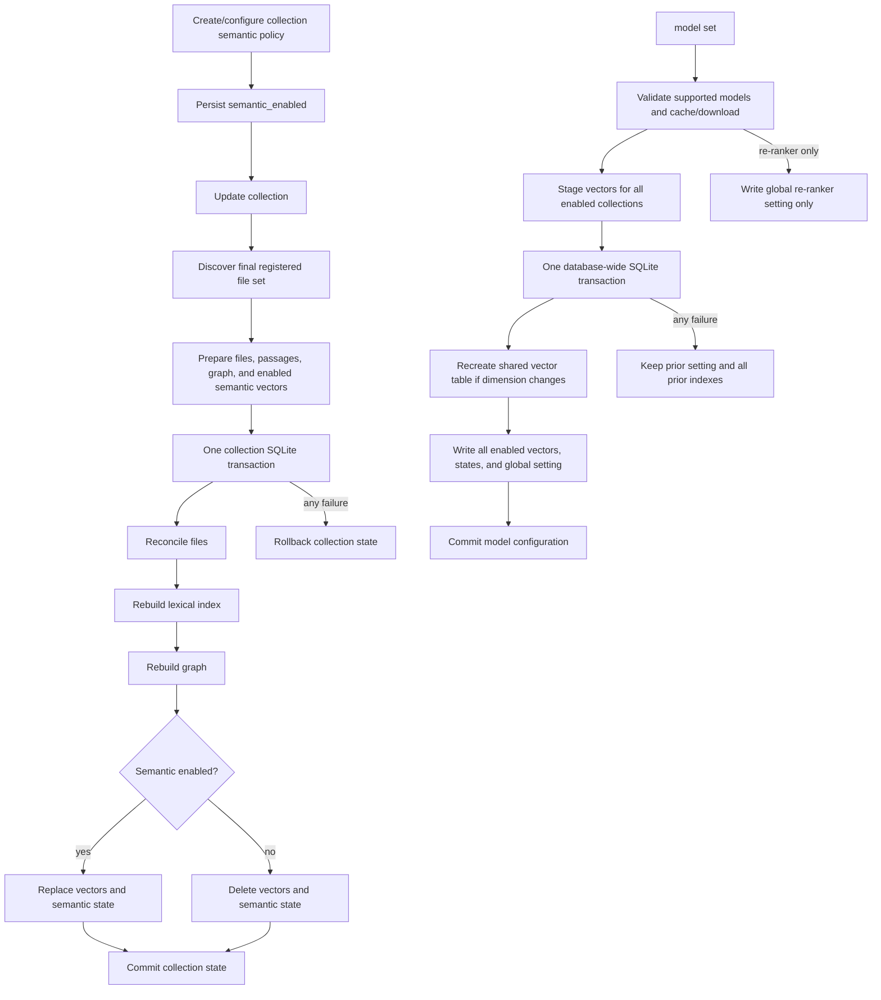

# Design

## Context And Constraints

US-022 makes semantic indexing a per-collection policy and brings enabled
semantic indexes into the source-aware update. Today `SqliteFileStore::reconcile`
commits files, lexical passages, and the graph in one transaction. Semantic
rebuilds happen through `SqliteSemanticIndexStore` on a separate connection and
transaction. The update path must therefore stage semantic work before calling
one store transaction that commits the collection's full state.

The `EmbedCollections` use case currently persists a global model before
rebuilding collections individually. A model change must instead stage all
affected embeddings first and then apply the model setting, vector-table change,
and every enabled collection's semantic state in one transaction. The existing
single shared vector table and dimension rules from ADR-010 remain in force.

Constraints:

- Keep the single-binary, local-first Rust architecture and existing crate
  boundaries.
- Add no crate, workspace member, dependency, or architectural layer.
- Keep fastembed inference behind the existing embedding and re-ranker ports.
- Downloads remain explicit and use the model-cache rules in ADR-012.
- Preserve the existing CLI grammar in this slice. Add `model list` and
  `model set`; retain `embed` temporarily, with semantic configuration as its
  prerequisite. The final command-grammar replacement belongs to a later slice.
- Migrate schema version 8 to version 9 without changing files or index data.

## Proposed Design

Persist an explicit semantic-enabled policy on each collection. Schema version
9 adds a constrained `semantic_enabled` value to `collections`, defaulting to
false. The migration initializes it to true only for collections with an
existing `semantic_index_state` row. This makes legacy behavior deterministic
without inferring enablement from file paths or rebuilding any index.

Extend the current collection configuration path to create and update that
policy. `collection create --semantic` opts in; `collection configure
NAME --semantic on|off` changes it without indexing. The existing `embed`
command rejects disabled collections and directs users to configure them
first. An update is the operation that applies the stored policy.

The update use case stages the final source-discovered file set and any needed
semantic embeddings before mutation. It passes the staged semantic batch and
model metadata to the existing file-store reconciliation boundary. The SQLite
adapter uses one transaction for file changes, lexical-index rebuilding,
graph rebuilding, semantic-vector replacement or cleanup, and semantic-state
updates. An indexing error rolls back the full collection update. In
`update --all`, each collection still gets its own transaction and a failure
does not prevent later collections from being attempted.

Add `model list` through the existing embedding and re-ranker ports. Each port
reports its supported model names and whether assets are available in the
resolved cache; listing does not download or mutate settings. Add `model set
[NAME] [--reranker NAME] [--download]`, requiring at least one model input and
leaving an omitted setting unchanged. The existing `embed --model` and
`embed --reranker` options remain during this transitional slice and route
model changes through the same configuration use case.

When an embedding model changes, the application stages embeddings for all
semantic-enabled collections, independent of the old `embed --collection`
scope. A single semantic-store transaction updates the global model setting,
recreates the shared vector table if its dimension changes, writes every
collection's vectors and semantic-index state, and commits. Failure during
validation, availability checks, inference, or the transaction leaves the
previous settings and indexes active. A re-ranker-only change writes only the
global re-ranker setting and does not touch vectors.

## Components And Responsibilities

| Component | Responsibility | Depends on |
| --- | --- | --- |
| Collection domain/configuration types | Represent semantic policy as enabled or disabled | `domain` |
| Existing `CollectionStore` and `CollectionSourceStore` ports | Create collections with default/opt-in policy and persist configuration updates | Domain types |
| Existing `FileStore` port | Accept prepared semantic work at the atomic reconcile boundary | Domain file, passage, embedding, and model types |
| Existing `SemanticIndexStore` port | Read enabled collections and semantic state; atomically apply global model rebuild batches | Domain types |
| Existing `EmbeddingGenerator` and `Reranker` ports | Enumerate supported models, report local availability, and prepare embeddings/provision models | Domain model types |
| Collection configuration use case | Validate and persist semantic enablement without indexing | Collection configuration stores |
| `UpdateCollection` use case | Discover final files, prepare enabled semantic embeddings, and request atomic collection reconciliation | Filesystem, clock, existing stores, embedding generator |
| Model management use case | List model availability and stage/commit global model changes | Embedding generator, re-ranker, semantic index store, clock |
| `SqliteFileStore` | Commit files, lexical, graph, and configured semantic indexes in one collection transaction | SQLite and registered vector extension |
| `SqliteSemanticIndexStore` | Commit global settings and multi-collection vector rebuild in one transaction | SQLite and registered vector extension |
| CLI dispatch and rendering | Wire collection semantic options, model list/set, and transitional embed behavior | Existing app use cases |

## Interfaces And Contracts

| Interface | Inputs | Outputs | Errors |
| --- | --- | --- | --- |
| Collection creation/configuration | Name, sources, optional semantic policy | Persisted collection configuration | Invalid policy/name, not found, duplicate, storage |
| `FileStore::reconcile` extension | Collection, file upserts/deletes, staged semantic batch when enabled, model, timestamp | Reconcile counts and index outcomes | Not found, filesystem preparation, model availability/inference, transactional storage failure |
| Model catalog on existing generator ports | — | Supported model names and local-availability state | Cache inspection/storage failure |
| Model management use case | Optional embedding model, optional re-ranker, explicit download permission | Model list or model-change report | Invalid/unsupported model, unavailable asset, failed download, inference, clock, or transactional storage |
| Atomic model rebuild on `SemanticIndexStore` | New global model and all prepared collection batches | Committed global setting and per-collection rebuild outcomes | Storage failure; transaction rolls back settings and vectors |

Prepared update vectors are associated with the discovered file path and
logical passage kind/position until the SQLite transaction resolves each path
to its committed file ID. Persisted vectors continue using the logical
`(file_id, kind, position)` identity defined by ADR-006. This permits inference
before the write transaction, including for files that do not yet have a
database file ID.

## Data And State Flow

For update-all, collection transactions execute independently. For a global
embedding-model change, all embeddings are staged before the single commit
transaction so inference failure cannot expose a partially switched database.
The shared vector table's dimension recreation and setting update participate
in the same transaction as all collection vector/state writes.

## Security, Performance, And Operations

- Security: inference remains local; network access is limited to explicit
  `--download`. Model names are validated through existing adapters and all
  database values remain parameter-bound.
- Performance: update and global model selection perform inference before
  acquiring the SQLite write transaction. Global model changes temporarily
  hold all prepared vectors in memory; memory use is proportional to the
  semantic passage count being rebuilt.
- Operations: schema version 9 adds the collection policy and deterministically
  migrates existing semantic-enabled state. A failed transaction is safe to
  retry; downloaded cache files may remain after a later database rollback.
- Compatibility: existing databases migrate in place; existing semantic
  indexes remain enabled. The existing `embed` command stays available until
  the final grammar slice and refuses disabled collections with configuration
  guidance.

## Alternatives Considered

| Alternative | Why not chosen |
| --- | --- |
| Infer enablement from the existence of vectors or semantic state | Cannot represent an explicit disabled policy independently and risks rebuilding an index that the user disabled |
| Add a new semantic configuration table | The policy belongs to the collection and fits as one constrained collection property; a separate table adds joins and lifecycle handling |
| Embed while holding the collection write transaction | Holds SQLite's write lock during potentially long CPU inference and increases contention without improving rollback guarantees |
| Commit global model changes one collection at a time | A later failure can leave a subset of collections using the new model and violate global comparability |
| Add a new store adapter, crate, or dependency for combined updates | Existing SQLite file and semantic stores already own the required tables and transaction support; composition can remain in current layers |

## Risks And Open Decisions

- The vendored vector virtual table must support transactional delete/insert and
  dimension-changing table recreation alongside settings updates. Adapter
  integration tests will prove rollback at each operation; if the extension
  cannot do this, implementation must stop and revise the design before code.
- Holding staged vectors for all enabled collections during a model change may
  consume substantial memory for large databases. The PRD makes index-build
  time unconstrained, but memory limits are not explicitly quantified.
- The per-file staged update identity must map to the same logical passage
  ordering used by lexical indexing. Tests will compare the complete resulting
  passage/vector set after additions, edits, and deletions.
- Existing model commands have overlapping responsibilities during the
  transition. Both old and new command paths must use the same model-change
  transaction.

## Verification Approach

- Domain/application tests cover policy defaults, explicit configuration,
  enable/disable reconciliation, model-change targeting, validation, and
  update-all continuation using behavioral fakes.
- SQLite integration tests cover schema migration from versions 0–8, legacy
  semantic-state backfill, transactional vector deletion/rebuild, dimension
  recreation, global setting rollback, and file/lexical/graph/semantic rollback.
- CLI subprocess tests cover collection flags, `model list`, model setting and
  validation, reranker-only changes, explicit downloads, and disabled legacy
  `embed` behavior with real exit codes and streams.
- Preserve existing semantic, hybrid, graph, lexical, and JSON retrieval
  contracts; run spec validation, `cargo xtask ci`, evaluation verification,
  and retrieval evaluation through `verify-feature`.
