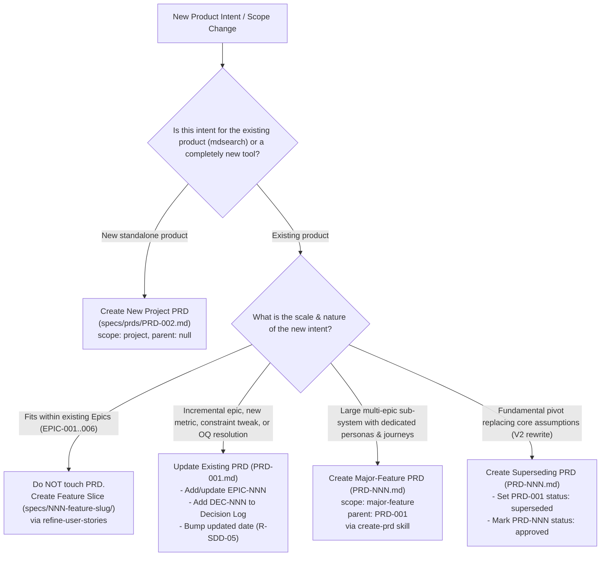

# PRD Lifecycle Guide: Updating Existing PRDs vs Creating New PRDs

## 1. Overview and Purpose

This document establishes the official decision framework and operational guidelines for managing Product Requirements Documents (PRDs) in this repository. It clarifies when to **update an existing PRD** (in-place evolution), when to **create a new child/major-feature PRD** (`scope: major-feature`), and when to **create a new project PRD** (`scope: project`).

---

## 2. Core Decision Rule

- **Update `PRD-001`** when refining the existing product vision, adding new epics within the existing product boundary, updating metrics, or recording product decisions.
- **Create a Child `PRD-NNN` (`scope: major-feature`)** when a massive, multi-epic capability arises with its own distinct personas, journeys, and lifecycle that would bloat the core project PRD.
- **Create a Replacement `PRD-NNN` (`scope: project`)** only when a radical architectural/product pivot occurs that supersedes the original vision.
- **Do NOT create/update a PRD** for ordinary feature slices, bugfixes, or technical implementation changes (use `specs/NNN-feature-slug/` and `ADRs` instead).

---

## 3. PRD Decision Framework



---

## 4. Detailed Scenarios & Guidance

### 4.1 When to UPDATE the Existing PRD (`specs/prds/PRD-001.md`)

Updating the existing PRD is the **default and most common path** for evolving product intent.

| Trigger / Intent | What to Update in `PRD-001.md` |
|---|---|
| **Adding a new capability to the product** (e.g. adding an export/backup command or tag filtering) | Add a new Epic to **Section 4: Functional Scope** (e.g. `EPIC-007: Collection export and backup`). |
| **Resolving an open product question** | Update the status and resolution note in **Section 7: Open Questions** (e.g. `OQ-002: FastEmbed resolution`). |
| **Adopting a major product decision** | Add an entry to **Section 8: Decision Log** (`DEC-012`, `DEC-013`). |
| **Refining success metrics or performance targets** | Update **Section 3: Success Metrics** (e.g. setting concrete latency thresholds after benchmarking). |
| **Adjusting out-of-scope boundaries** | If a previously excluded feature is now supported (e.g., supporting stdin pipe search), move it from *Out of Scope* to *In Scope* with a corresponding `DEC-NNN`. |

**Governance Rules for Updates:**
- Bump `updated: YYYY-MM-DD` in the frontmatter.
- Preserve existing Epic IDs (`EPIC-001` .. `EPIC-006`); append new ones monotonically (`EPIC-007`).
- Never overwrite past decisions silently; record why the change occurred in the Decision Log.

---

### 4.2 When to CREATE a New Major-Feature PRD (`specs/prds/PRD-NNN.md`)

Use the `create-prd` skill with `scope: major-feature` when an expansion is so large that keeping it in `PRD-001` would make the document unwieldy and unreadable.

**Key Indicators:**
- It introduces **new personas** or substantially distinct user journeys (e.g., an interactive Web UI / TUI inspection dashboard for knowledge graphs).
- It contains **multiple sub-epics** (e.g., an entire offline entity graph extraction and relationship reasoning pipeline).
- It has its own dedicated success metrics and non-functional constraints that don't apply to the CLI tool.

**Structure of a Major-Feature PRD:**
```yaml
---
id: PRD-002
title: "Interactive Graph Visualization Dashboard"
type: product-requirements
scope: major-feature
status: approved
created: 2026-09-01
updated: 2026-09-01
owner: Quentin
parent: PRD-001
related: [PRD-001]
---
```

---

### 4.3 When to CREATE a Superseding Project PRD

A new project PRD (`scope: project`) is created only during a **fundamental product paradigm shift**:
- The tool transitions from a single-user offline CLI to a multi-tenant client-server architecture with cloud synchronization.
- Core non-functional requirements or mission statements are deprecated and replaced.

**Procedure:**
1. Author `PRD-002.md` using `create-prd`.
2. Update `PRD-001.md` frontmatter: `status: superseded`, `related: [PRD-002]`.
3. Set `PRD-002.md` frontmatter: `status: approved`, `supersedes: PRD-001`.

---

### 4.4 When NOT to Modify or Create a PRD

To keep the SDD workflow lightweight and effective, **do not** touch the PRD for:
1. **Vertical Feature Slices**: Implementing `001-create-collection`, `004-add-files`, etc. These are tracked in `specs/NNN-feature-slug/user-story.md`.
2. **Technical & Architectural Decisions**: Choosing SQLite, FastEmbed, or memory layout belongs in `specs/adr/ADR-NNN.md`.
3. **Bugfixes & Regressions**: Handled directly in the feature's `requirements.md` / `scenarios.feature` / tests.
4. **Minor UI/CLI Ergonomics**: Formatting adjustments or flag naming refinements that don't alter the epic's core outcome.

---

## 5. Comparison Matrix

| Aspect | In-Place PRD Update | Major-Feature PRD (`PRD-NNN`) | New Project PRD (`PRD-NNN`) | Feature Slice (`specs/NNN-...`) |
|---|---|---|---|---|
| **Location** | `specs/prds/PRD-001.md` | `specs/prds/PRD-002.md` | `specs/prds/PRD-002.md` | `specs/NNN-slug/` |
| **Frontmatter Scope** | `scope: project` | `scope: major-feature` | `scope: project` | `N/A` (`US-NNN`) |
| **Parent Field** | `parent: null` | `parent: PRD-001` | `parent: null` | `epic: EPIC-NNN` |
| **Lifecycle Frequency** | Continuous (as scope evolves) | Rare (large modular systems) | Exceptional (pivots / V2) | High (every sprint / slice) |
| **Skill Used** | Direct edit / `create-prd` revision | `create-prd` (interview mode) | `create-prd` (interview mode) | `refine-user-stories` |
